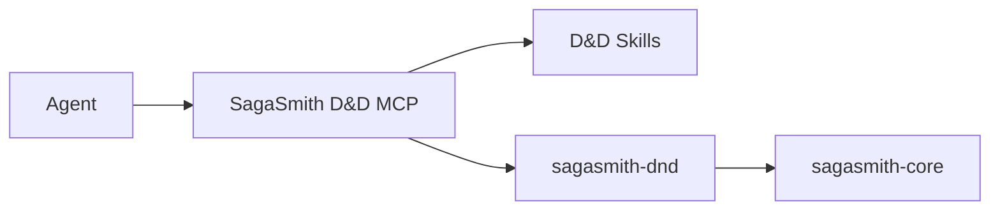

# SagaSmith D&D

[中文](README.md) · [English](README-en.md) · [D&D MCP](https://github.com/SagaSmithAI/SagaSmith-dnd-mcp)

**The D&D 5e 2014/2024 rules runtime for SagaSmithAI.** This package implements testable character, spell, activity, rule-pack, spatial, and structured-combat logic, and registers the `dnd5e` plugin through `sagasmith.systems`.

> Skills teach an agent how to run the table. MCP controls capabilities. This package turns settled rules inputs into verifiable outcomes.

## Platform role



Agents should normally connect through [SagaSmith-dnd-mcp](https://github.com/SagaSmithAI/SagaSmith-dnd-mcp), not construct CLI commands or write databases directly. The CLI remains useful for development, diagnostics, and portable integrations; the Python package is the rules/content implementation layer.

## Implemented capabilities

- **Versioned core rule packs** — 2014/2024 packs, profiles, mechanic IR, extension composition, and provenance locks.
- **Character data** — D&D sheet validation, derived stats, weapons/ammunition, encumbrance, resources, proficiencies, and restorable state.
- **Character creation** — standard array, point buy, rolling, edition differences, and structured core class/species/background/feat content.
- **Spells** — spell data, casting resources, preparation, concentration, readied spells, targets, saves, and timing boundaries.
- **Structured combat** — initiative, turns, action economy, attack preflight/commit, typed damage, resistance/immunity, unconsciousness, death saves, reactions, and choice windows.
- **Spatial semantics** — module location evidence, temporary maps created when combat starts, movement, distance, reach, and opportunity attacks.
- **Non-combat activities** — checks, rests, resources, and common activities with guards against bypassing the combat state machine.
- **Content ingestion** — D&D module profiles, structured core content, and extension rulebook draft/validation flows.

## Long-term memory boundary

- Objective world facts belong to Core CampaignMemory and use stable `fact_key`
  identities; the CLI exposes `memory upsert/revise` for diagnostics.
- A PC or NPC's memories, beliefs, rumors, and misconceptions belong to ActorKnowledge.
- `character.notes.memories` remains only for legacy character documents.
  `character memory migrate` emits ActorKnowledge candidates; new features must
  not treat the embedded list as authoritative memory.
- `continuity commit --payload ...` atomically persists a scene event, fact
  changes, actor knowledge, and an optional snapshot.

## Automation versus rulings

The engine automates mechanics only when rules inputs are settled: attack bonus, AC, dice expression, damage type, save DC, resources, and current state. It must not invent intent, targets, line of sight, cover, hidden state, missing distances, optional-rule selection, precedence, homebrew, NPC decisions, or narrative consequences.

The MCP layer represents uncertainty through preflight results, choice windows, and ruling-required responses. An agent or human GM supplies the missing judgment before the engine commits deterministic effects.

## Install and CLI

Requires Python 3.11+:

```bash
pip install "sagasmith-dnd[all]"
sagasmith-dnd doctor --json
sagasmith-dnd --help
```

| Extra | Purpose |
|---|---|
| `documents` | PDF parsing |
| `dense` | sentence-transformers + ChromaDB |
| `all` | document, embedding, and vector dependencies |

## Extension rule packs

Extensions do not override the core through scattered conditionals. Ingestion produces a provenance-bearing draft pack, validates schema, dependencies, edition, and mechanic IR, then binds the pack to a campaign profile. Campaigns lock exact core/extension versions, and snapshot restoration requires the same dependency set.

This allows legally owned supplements to add subclasses, backgrounds, spells, and executable mechanics without losing the 2014/2024 core boundaries and regression fixes. Commercial book content is not distributed with this repository.

## Development

```bash
pip install -e ".[all,dev]"
pytest --cov
ruff check .
```

Tests cover rule packs, core content, preserved rule boundaries, character schemas, spells, lifecycle, spatial behavior, and combat.

## Content and license

Code is MIT licensed. D&D 5e SRD-derived content follows the applicable CC-BY-4.0 terms; convenience translations retain upstream attribution. Non-SRD commercial content must be imported by an authorized user.
