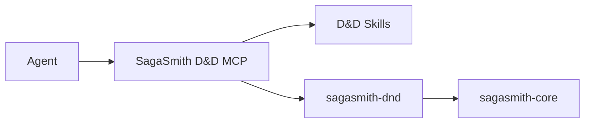

# SagaSmith D&D

[中文](README.md) · [English](README-en.md) · [D&D MCP](https://github.com/SagaSmithAI/SagaSmith-dnd-mcp)

**The D&D 5e 2014/2024 rules runtime for SagaSmithAI.** This package implements testable character, spell, activity, rule-pack, spatial, and structured-combat logic, and registers the `dnd5e` plugin through `sagasmith.systems`.

> Skills teach an agent how to run the table. MCP controls capabilities. This package turns settled rules inputs into verifiable outcomes.

## Platform role


```mermaid
flowchart LR
    A[Agent] --> M[SagaSmith D&D MCP]
    M --> S[D&D Skills]
    M --> D[sagasmith-dnd]
    D --> C[sagasmith-core]
```

Agents should normally connect through [SagaSmith-dnd-mcp](https://github.com/SagaSmithAI/SagaSmith-dnd-mcp), not construct CLI commands or write databases directly. The CLI remains useful for development, diagnostics, and portable integrations; the Python package is the rules/content implementation layer.

## Implemented capabilities

- **Versioned core rule packs** — 2014/2024 packs, profiles, mechanic IR, extension composition, and provenance locks.
- **Character data** — D&D sheet validation, derived stats, weapons/ammunition, encumbrance, resources, proficiencies, and restorable state.
- **Character creation** — standard array, point buy, rolling, edition differences, and structured core class/species/background/feat content.
- **Spells** — spell data, casting resources, preparation, concentration, readied spells, targets, saves, and timing boundaries.
- **Structured combat** — initiative, turns, action economy, attack preflight/commit, typed damage, resistance/immunity, unconsciousness, death saves, reactions, and choice windows.
- **Spatial semantics** — module location evidence, temporary maps created when combat starts, movement, distance, reach, and opportunity attacks.
- **Non-combat activities** — checks, rests, resources, and common activities with guards against bypassing the combat state machine.
- **Content ingestion** — D&D module profiles, structured core content, and extension rulebook draft/validation flows.
- **Portable actors** — one D&D actor-card validator for PCs/NPCs/monsters, plus bundled SRD 2014/2024 creature preset packs.

## Unified actor cards and bundled creature packs

`build_dnd_actor_card` / `validate_dnd_actor_card` apply D&D sheet-v2 and
edition validation on top of the Core portable envelope. PCs, NPCs, and monsters
do not have separate sharing formats: each is a complete actor card, separated
only by `actor_type`, provenance, and card mechanics.

`build_srd2014_preset_pack` produces 317 cards from the bundled SRD 5.1
Markdown; `build_srd2024_preset_pack` produces 330 from SRD 5.2.1. Every card
retains the normalized statblock, source text/checksum/reference, parser
warnings, license, and attribution. Actionless 2014 creatures and speed 0 are
valid. A 2024 MOD/SAVE-only table uses a canonical representative score that
preserves the printed modifier/save exactly and records that normalization in
provenance instead of inventing an unsupported odd/even score.

Private builds of commercial 2014 books also settle layout variants before
runtime: explicit `Actions for Type ...` sections become separate actor cards,
each containing only that action set. One missing ability label is recovered
only when all six printed scores exist and the other five labels establish a
unique column; a damaged redundant modifier may be recomputed only from its
clearly printed score. Monster Manual cards may reuse a bundled SRD identity
only for `edition=2014`, `publication_id=mm2014`, and one unique name match,
with the original checksum recorded in the rebuilt private card. Other books,
same-name variants, and differing mechanics are never replaced by name. A
visibly damaged heading may likewise be superseded only by one reviewed actor
on the same page.

The bundled structured catalogs have exact coverage gates: 1,014 SRD 2014
artifacts (including 319 spells, 474 items, and 182 features) and 1,463 SRD
2024 artifacts (including 339 spells, 471 items, 269 features, and 330
monsters). The multilingual source index covers exactly 2,032 Markdown files
in 42 source partitions. Missing or duplicate files, count drift, duplicate
artifact IDs, and missing citations fail tests. Non-SRD text from the three
commercial core books is not distributed in this Apache-2.0 repository; an
owner may compile legally held PHB/DMG/MM files as private core addons.
Every bundled artifact also receives a complete build-time clause set that
separates structured grants, registered kernel mechanics, descriptive text,
and exact-source Agent-DM rulings. Release audit requires
`first_use_compilation_required=false`; runtime never authors its resolution.
Dice procedures, numbered random-effect tables, and adjudication guidance that
do not match a specialized schema cannot fall through as descriptive prose.
Each such chunk keeps exact evidence and receives a direct Agent-DM clause at
build time; only context proven free of mechanical procedure is descriptive.

Removing monster hardcoding means identities, statistics, attacks, traits, and
sources no longer come from creature-name tables or constructors. Generic
standard-rule implementations remain engine code—action economy, attacks,
saves, damage, defenses, and card-declared generic traits—but read their inputs
from cards rather than branching on monster names. Homebrew semantics are fixed
during import, review, or export as a source-bound typed plan or direct Agent-DM
ruling boundary; runtime does not author a solution on first use.

## Long-term memory boundary

- Objective world facts belong to Core CampaignMemory and use stable `fact_key`
  identities; the CLI exposes `memory upsert/revise` for diagnostics.
- A PC or NPC's memories, beliefs, rumors, and misconceptions belong to ActorKnowledge.
- `character.notes.memories` remains only for legacy character documents.
  `character memory migrate` emits ActorKnowledge candidates; new features must
  not treat the embedded list as authoritative memory.
- `continuity commit --payload ...` atomically persists a scene event, fact
  changes, actor knowledge, and an optional snapshot.

## Automation versus rulings

The engine automates mechanics only when rules inputs are settled: attack bonus, AC, dice expression, damage type, save DC, resources, and current state. It must not invent intent, targets, line of sight, cover, hidden state, missing distances, optional-rule selection, precedence, homebrew, NPC decisions, or narrative consequences.

The MCP layer represents uncertainty through preflight results, choice windows, and ruling-required responses. The active SagaSmith Agent acts as GM and supplies ordinary scene, module, spell, and narrative judgments by default before the engine commits deterministic effects. Only player-owned choices, owner approvals, permission changes, and missing or conflicting source evidence require external input.

## Install and CLI

Requires Python 3.11+:

```bash
pip install "sagasmith-dnd[all]"
sagasmith-dnd doctor --json
sagasmith-dnd --help
```

| Extra | Purpose |
|---|---|
| `documents` | PDF parsing |
| `dense` | sentence-transformers + ChromaDB |
| `all` | document, embedding, and vector dependencies |

## Extension rule packs

Extensions do not override the core through scattered conditionals. Ingestion produces a provenance-bearing draft pack, validates schema, dependencies, edition, and mechanic IR, then binds the pack to a campaign profile. Campaigns lock exact core/extension versions, and snapshot restoration requires the same dependency set.

This allows legally owned supplements to add subclasses, backgrounds, spells, and executable mechanics without losing the 2014/2024 core boundaries and regression fixes. Commercial book content is not distributed with this repository.

Supplements can also ship as a composed package family: keep rules in an
edition/dependency/source-locked rule pack; distribute pregenerated PCs, NPCs,
monsters, and summons in a portable `preset_pack`; place adventures, maps, and
scenes in a separate `module_pack`. Link them with explicit dependencies instead
of one giant package that bypasses rule-install approval.

Modules use only the v2 `.sagasmith-module` archive. Its descriptor declares
edition compatibility, party/level/advancement guidance, continuity, content and
narrative catalogs, and readiness; content-addressed blobs travel in the archive.
The D&D plugin validates exact rule dependencies and actor cards, and only
`playable`/`complete` packages may enter the activation transaction. Addons do
not embed modules, and the removed module-pack v1 shape is not read.

For cross-installation migration, a rule pack carries its complete indexed
sources and replaces local `source_id`/`chunk_id` values with stable locators.
The receiver validates checksums, system, edition, and exact dependencies, then
rebuilds sources and citations with fresh local ids. A standalone rule pack must
also carry a `build_time_complete` resolution audit exactly equal to the
receiver's recomputation; missing, stale, or deferred semantics block export,
import, and installation. The result is only a
validated inactive draft: installation and campaign Owner/DM activation remain
separate. Rule dependencies use the UUID-independent definition checksum; a
thin `release_manifest` pins each complete component-envelope checksum. It
grants no installation or activation authority.

## Development

```bash
pip install -e ".[all,dev]"
pytest --cov
ruff check .
```

Tests cover rule packs, core content, preserved rule boundaries, character schemas, spells, lifecycle, spatial behavior, and combat.

## Content and license

Original code is licensed under Apache-2.0. D&D 5e SRD-derived content follows the applicable CC-BY-4.0 terms; convenience translations retain upstream attribution. Non-SRD commercial content must be imported by an authorized user.
