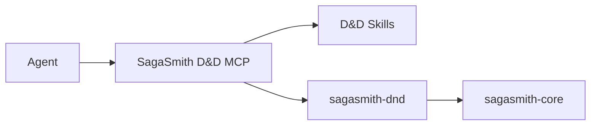

# SagaSmith D&D

[中文](README.md) · [English](README-en.md) · [D&D MCP](https://github.com/SagaSmithAI/SagaSmith-dnd-mcp)

**SagaSmithAI 的 D&D 5e 2014/2024 规则运行时。** 本仓库实现可测试的角色、法术、活动、规则包、空间与结构化战斗逻辑，并通过 `sagasmith.systems` 注册 `dnd5e` 系统插件。

> Skills 教 Agent 如何主持；MCP 管理能力边界；这个包负责把已经确定的规则输入结算成可验证结果。

## 在平台中的职责



推荐的 Agent 接入点是 [SagaSmith-dnd-mcp](https://github.com/SagaSmithAI/SagaSmith-dnd-mcp)，而不是让 Agent 直接拼 CLI 或修改数据库。CLI 保留给开发、诊断和便携集成；Python 包是规则与内容实现层。

## 已实现能力

- **版本化核心规则包** — 2014/2024 core pack、规则 profile、mechanic IR、扩展包组合与来源锁定。
- **角色数据** — D&D sheet 校验、派生属性、武器/弹药、负重、资源、熟练项与可恢复状态。
- **角色创建** — 标准数组、购点、掷骰与版本差异；核心职业、物种/种族、背景和专长内容。
- **法术** — 法术数据、施法资源、准备法术、专注、Ready spell 与目标/豁免边界。
- **结构化战斗** — 先攻、回合、动作经济、攻击预检与提交、伤害类型、抗性/免疫、倒地、死亡豁免、反应和选择窗口。
- **空间语义** — 模组房间/地点证据，战斗开始时生成临时 map，移动、距离、触及和机会攻击。
- **非战斗活动** — 检定、休息、资源与常见角色活动；战斗中禁止绕过战斗状态机修改同一状态。
- **内容导入** — D&D 模组 profile、结构化规则内容、扩展规则书草稿与校验路径。

## 长期记忆边界

- 客观世界事实写入 Core CampaignMemory，并使用稳定 `fact_key`；CLI 提供
  `memory upsert/revise` 作为诊断接口。
- PC/NPC 的记忆、信念、谣言和误解写入 ActorKnowledge。
- `character.notes.memories` 只为旧角色文档保留。`character memory migrate`
  可以生成 ActorKnowledge 候选；新功能不得继续把它当作权威记忆库。
- 场景收尾可用 `continuity commit --payload ...` 原子写入事件、事实、角色认知和快照。

## 自动结算与 GM 裁决的边界

引擎只自动结算 **规则输入已经明确** 的机械部分，例如攻击加值、AC、骰式、伤害类型、豁免 DC、资源和当前状态。以下信息不应由引擎猜测：

- 行动意图、目标选择与叙事前提；
- 视线、掩护、隐藏、触发时机和地图中未给出的距离；
- 可选规则、规则冲突、特例优先级和 homebrew；
- NPC 是否投降、环境后果或失败代价。

MCP 层会用 preflight、choice window 和 ruling-required 结果把这些问题交回 Agent/GM，再由引擎提交确定性部分。

## 安装与 CLI

Python 3.11+：

```bash
pip install "sagasmith-dnd[all]"
sagasmith-dnd doctor --json
```

可选 extras：

| Extra | 用途 |
|---|---|
| `documents` | PDF 文档解析 |
| `dense` | sentence-transformers + ChromaDB |
| `all` | 文档、嵌入与向量依赖 |

查看 CLI 的当前命令契约：

```bash
sagasmith-dnd --help
sagasmith-dnd doctor --json
sagasmith-dnd database upgrade --json
```

## 扩展规则包

扩展书不会通过散落的条件判断直接覆盖核心逻辑。导入流程将内容转成带 provenance 的 draft rule pack，验证 schema、依赖、edition 与 mechanic IR，随后绑定到 campaign rule profile。战役锁定核心包与扩展版本，Snapshot 恢复时必须能解析同一套精确依赖。

这允许 Xanathar 等用户合法持有的扩展内容添加子职、背景、法术和可结算 mechanics，同时保留 2014/2024 核心边界与既有修复。商业书内容不随仓库分发。

## 开发

```bash
pip install -e ".[all,dev]"
pytest --cov
ruff check .
```

测试重点覆盖 rule pack、核心内容、保留规则边界、角色 schema、法术、生命周期、空间与战斗引擎。

## 内容与许可

代码使用 MIT License。D&D 5e SRD 派生内容遵循对应 CC-BY-4.0 条款；中文便利翻译保留原项目许可和署名。非 SRD 商业内容必须由用户自行合法导入。
