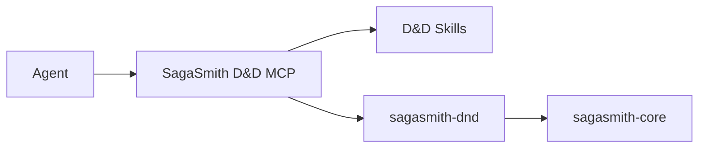

# SagaSmith D&D

[中文](README.md) · [English](README-en.md) · [D&D MCP](https://github.com/SagaSmithAI/SagaSmith-dnd-mcp)

**SagaSmithAI 的 D&D 5e 2014/2024 规则运行时。** 本仓库实现可测试的角色、法术、活动、规则包、空间与结构化战斗逻辑，并通过 `sagasmith.systems` 注册 `dnd5e` 系统插件。

> Skills 教 Agent 如何主持；MCP 管理能力边界；这个包负责把已经确定的规则输入结算成可验证结果。

## 在平台中的职责


```mermaid
flowchart LR
    A[Agent] --> M[SagaSmith D&D MCP]
    M --> S[D&D Skills]
    M --> D[sagasmith-dnd]
    D --> C[sagasmith-core]
```

推荐的 Agent 接入点是 [SagaSmith-dnd-mcp](https://github.com/SagaSmithAI/SagaSmith-dnd-mcp)，而不是让 Agent 直接拼 CLI 或修改数据库。CLI 保留给开发、诊断和便携集成；Python 包是规则与内容实现层。

## 已实现能力

- **版本化核心规则包** — 2014/2024 core pack、规则 profile、mechanic IR、扩展包组合与来源锁定。
- **角色数据** — D&D sheet 校验、派生属性、武器/弹药、负重、资源、熟练项与可恢复状态。
- **角色创建** — 标准数组、购点、掷骰与版本差异；核心职业、物种/种族、背景和专长内容。
- **法术** — 法术数据、施法资源、准备法术、专注、Ready spell 与目标/豁免边界。
- **结构化战斗** — 先攻、回合、动作经济、攻击预检与提交、伤害类型、抗性/免疫、倒地、死亡豁免、反应和选择窗口。
- **空间语义** — 模组房间/地点证据，战斗开始时生成临时 map，移动、距离、触及和机会攻击。
- **非战斗活动** — 检定、休息、资源与常见角色活动；战斗中禁止绕过战斗状态机修改同一状态。
- **内容导入** — D&D 模组 profile、结构化规则内容、扩展规则书草稿与校验路径。
- **可移植角色内容** — PC/NPC/怪物共用 actor-card validator；SRD 2014/2024 怪物与 NPC 生成默认 preset pack。

## 统一角色卡与默认怪物包

`build_dnd_actor_card` / `validate_dnd_actor_card` 在 Core portable envelope
之上执行 D&D sheet v2 与 edition 校验。PC、NPC 和怪物没有三套分享格式；
它们都是完整角色卡，只由 `actor_type`、来源和卡内 mechanics 区分。

`build_srd2014_preset_pack` 从随附 SRD 5.1 Markdown 生成 317 张卡，
`build_srd2024_preset_pack` 从 SRD 5.2.1 生成 330 张卡。每张卡保留规范化
statblock、原始来源文本/checksum、source ref、parser warning、license 与
attribution。2014 无 Action 生物与速度 0 的 statblock 仍是合法卡；2024
MOD/SAVE-only 表只保存能够严格保留印刷 modifier/save 的规范代表值，并把
该规范化写入 provenance，不伪造不可证明的奇偶分数。

商业 2014 规则书的私有构建同样不得把版式差异变成运行时补义：显式
`Actions for Type …` 小节会拆成各自只携带对应动作组的独立 actor card；一个
缺失的能力标签仅能在六列分数完整、其余五个标签顺序唯一时按列位恢复，印刷
modifier 损坏也只在分数本身清晰时由分数重算。Monster Manual 只有在
`edition=2014`、`publication_id=mm2014` 且名称唯一匹配时，才能复用同一身份的
内置 SRD 卡，并在新包中记录原卡 checksum；其他书、同名变体或数值差异不得
按名称替换。明显受损的标题也只能被同页唯一、已审核的身份取代。

内置结构化目录使用精确覆盖门禁：2014 SRD 为 1,014 个条目（含 319
法术、474 物品和 182 特性），2024 SRD 为 1,463 个条目（含 339 法术、
471 物品、269 特性和 330 怪物）。随附中英文来源索引共覆盖 2,032 个
Markdown 文件、42 个 source partition；任何文件遗漏、重复、条目数量漂移、
重复 ID 或缺失来源引用都会使测试失败。三本商业核心书的非 SRD 原文不会随
Apache-2.0 仓库发布；合法持有者可把本地 PHB/DMG/MM 编译为 private core addon。
两版内置目录的每个条目还必须在构建时写入完整 clause set：结构化选择与授予、
已注册内核机制、纯描述和带精确来源摘录的 Agent-DM 裁定分别标注；发布审计要求
`first_use_compilation_required=false`，运行时不得再补写 resolution。
未匹配专用 schema 的掷骰流程、编号随机效果表和裁定指导也不能降级为纯描述；
它们按 chunk 保留精确来源并在构建期写成 direct Agent-DM clause。只有经信号审计
确认不含机械过程的上下文才可标记为 descriptive。

“取消怪物硬编码”指怪物身份、数值、攻击、特性和来源不再由名称表或专属
构造器产生。标准规则的通用结算函数仍属于引擎，例如动作经济、攻击、豁免、
伤害、抗性与来源卡声明的通用 trait；运行时从卡片读取输入，不按怪物名字
选择结果。自设内容在导入、审核或导出时即保存来源绑定的 typed plan 或
Agent-DM 裁定边界；运行时只裁定当前事实，不再首次触发时补方案。

## 长期记忆边界

- 客观世界事实写入 Core CampaignMemory，并使用稳定 `fact_key`；CLI 提供
  `memory upsert/revise` 作为诊断接口。
- PC/NPC 的记忆、信念、谣言和误解写入 ActorKnowledge。
- `character.notes.memories` 只为旧角色文档保留。`character memory migrate`
  可以生成 ActorKnowledge 候选；新功能不得继续把它当作权威记忆库。
- 场景收尾可用 `continuity commit --payload ...` 原子写入事件、事实、角色认知和快照。

## 自动结算与 GM 裁决的边界

引擎只自动结算 **规则输入已经明确** 的机械部分，例如攻击加值、AC、骰式、伤害类型、豁免 DC、资源和当前状态。以下信息不应由引擎猜测：

- 行动意图、目标选择与叙事前提；
- 视线、掩护、隐藏、触发时机和地图中未给出的距离；
- 可选规则、规则冲突、特例优先级和 homebrew；
- NPC 是否投降、环境后果或失败代价。

MCP 层会用 preflight、choice window 和 ruling-required 结果把这些问题交回 Agent/GM，再由引擎提交确定性部分。

## 安装与 CLI

Python 3.11+：

```bash
pip install "sagasmith-dnd[all]"
sagasmith-dnd doctor --json
```

可选 extras：

| Extra | 用途 |
|---|---|
| `documents` | PDF 文档解析 |
| `dense` | sentence-transformers + ChromaDB |
| `all` | 文档、嵌入与向量依赖 |

查看 CLI 的当前命令契约：

```bash
sagasmith-dnd --help
sagasmith-dnd doctor --json
sagasmith-dnd database upgrade --json
```

## 扩展规则包

扩展书不会通过散落的条件判断直接覆盖核心逻辑。导入流程将内容转成带 provenance 的 draft rule pack，验证 schema、依赖、edition 与 mechanic IR，随后绑定到 campaign rule profile。战役锁定核心包与扩展版本，Snapshot 恢复时必须能解析同一套精确依赖。

这允许 Xanathar 等用户合法持有的扩展内容添加子职、背景、法术和可结算 mechanics，同时保留 2014/2024 核心边界与既有修复。商业书内容不随仓库分发。

扩展书也适合发布为组合包：规则内容继续使用带 edition/dependency/source
lock 的 rule pack；其中预设 PC、NPC、怪物或召唤物使用 portable
`preset_pack`；若附带冒险、地图或场景则另用 `module_pack`。不要把三者压成
一个可绕过规则安装审批的巨型包；用显式 dependency 将它们组合即可。

跨安装迁移时，rule pack 会同时携带完整的已索引来源，并把本地
`source_id`/`chunk_id` 改写为稳定 locator。接收端验证 checksum、system、edition
与精确依赖后，以新本地 id 重建来源和引用；规则依赖使用不受本地 UUID 影响的
definition checksum。独立 rule pack 也必须携带与接收端复算结果完全相同的
`build_time_complete` resolution audit；缺失、过期或仍有 deferred 内容时拒绝导出、
导入和安装。结果只是 validated inactive draft，仍需分别 install 和由战役
Owner/DM activation。薄 `release_manifest` 则锁定各完整组件 envelope 的精确版本与
checksum，不赋予任何安装或启用权限。

## 开发

```bash
pip install -e ".[all,dev]"
pytest --cov
ruff check .
```

测试重点覆盖 rule pack、核心内容、保留规则边界、角色 schema、法术、生命周期、空间与战斗引擎。

## 内容与许可

原创代码使用 Apache-2.0。D&D 5e SRD 派生内容遵循对应 CC-BY-4.0 条款；中文便利翻译保留原项目许可和署名。非 SRD 商业内容必须由用户自行合法导入。
统一 actor card v2 允许 PC、NPC、怪物各自携带一张自包含角色图。图片必须声明
许可、署名和来源，且只随 portable card/preset/addon 迁移；创建运行时角色时不会
写入角色实例或 Snapshot。`python -m sagasmith_dnd.public_library` 可将 SRD 预设
和显式标记为 `public`/`shareable` 的 addon 编译为 GitHub Pages 可读取的静态库；
私有或 `user-supplied` 内容会被拒绝发布。
