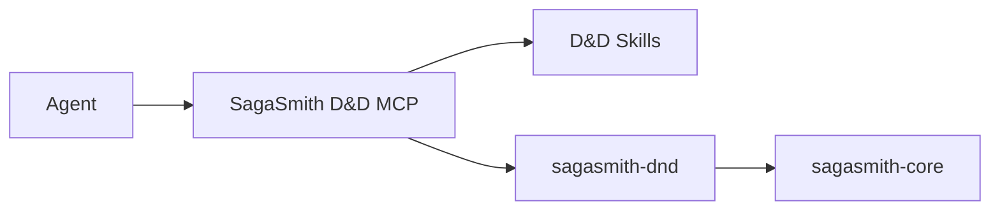

# SagaSmith D&D

[中文](README.md) · [English](README-en.md) · [Website](https://sagasmithai.github.io) · [Platform overview](https://github.com/SagaSmithAI/.github/blob/main/profile/README.md) · [D&D MCP](https://github.com/SagaSmithAI/sagasmith-dnd/tree/main/packages/mcp) · [SagaSmith Web](https://github.com/SagaSmithAI/SagaSmith-service) · [Content catalog](https://github.com/SagaSmithAI/SagaSmith-dnd-content-library)

> Current source lives at `sagasmith-dnd/packages/domain` and is versioned with the sibling MCP, Skills, and UI; the former split repositories are archived.

**The D&D 5e 2014/2024 rules runtime for SagaSmithAI.** This package implements testable character, spell, activity, rule-pack, spatial, and structured-combat logic, and registers the `dnd5e` plugin through `sagasmith.systems`.

> Skills teach an agent how to run the table. MCP controls capabilities. This package turns settled rules inputs into verifiable outcomes.

## Platform role



Agents should normally connect through [SagaSmith-dnd-mcp](https://github.com/SagaSmithAI/sagasmith-dnd/tree/main/packages/mcp), not construct CLI commands or write databases directly. The CLI remains useful for development, diagnostics, and content compilation; the Python package is the rules/content implementation layer.

## Implemented capabilities

- **Versioned core rule packs** — 2014/2024 packs, profiles, mechanic IR, extension composition, and provenance locks.
- **Character data** — D&D sheet validation, derived stats, weapons/ammunition, encumbrance, resources, proficiencies, and restorable state.
- **Character creation** — standard array, point buy, rolling, edition differences, and structured core class/species/background/feat content.
- **Spells** — spell data, casting resources, preparation, concentration, readied spells, targets, saves, and timing boundaries.
- **Structured combat** — initiative, turns, action economy, attack preflight/commit, typed damage, resistance/immunity, unconsciousness, death saves, reactions, and choice windows.
- **Spatial semantics** — explicit grid combat with temporary maps and coordinates, plus Agent-positioned combat with per-action structured spatial facts.
- **Non-combat activities** — checks, rests, resources, and common activities with guards against bypassing the combat state machine.
- **Content ingestion** — D&D module profiles, structured core content, and extension rulebook draft/validation flows.
- **Unified actor cards** — one D&D actor-card validator for PCs/NPCs/monsters, plus bundled SRD 2014/2024 creature preset Packs.

## Unified actor cards and bundled creature packs

The unified package's `sagasmith.actor-card.v3` applies D&D sheet-v2 and edition
validation on top of the Core schema. PCs, NPCs, and monsters do not have
separate sharing formats: each is a complete actor card, separated only by
`actor_type`, provenance, and card mechanics. Older builders are internal import
compiler adapters, not another public sharing format.

`build_srd2014_preset_actors` produces 317 actor-card.v3 values from the bundled
SRD 5.1 Markdown; `build_srd2024_preset_actors` produces 330 from SRD 5.2.1. Every actor
retains the normalized statblock, source text/checksum/reference, parser
warnings, license, and attribution. Actionless 2014 creatures and speed 0 are
valid. A 2024 MOD/SAVE-only table uses a canonical representative score that
preserves the printed modifier/save exactly and records that normalization in
provenance instead of inventing an unsupported odd/even score.

Private builds of commercial 2014 books also settle layout variants before
runtime: explicit `Actions for Type ...` sections become separate actor cards,
each containing only that action set. One missing ability label is recovered
only when all six printed scores exist and the other five labels establish a
unique column; a damaged redundant modifier may be recomputed only from its
clearly printed score. Monster Manual cards may reuse a bundled SRD identity
only for `edition=2014`, `publication_id=mm2014`, and one unique name match,
with the original checksum recorded in the rebuilt private card. Other books,
same-name variants, and differing mechanics are never replaced by name. A
visibly damaged heading may likewise be superseded only by one reviewed actor
on the same page.

The bundled structured catalogs have exact coverage gates: 1,014 SRD 2014
artifacts (including 319 spells, 474 items, and 182 features) and 1,463 SRD
2024 artifacts (including 339 spells, 471 items, 269 features, and 330
monsters). The multilingual source index covers exactly 2,032 Markdown files
in 42 source partitions. Missing or duplicate files, count drift, duplicate
artifact IDs, and missing citations fail tests. Non-SRD text from the three
commercial core books is not bundled with this Apache-2.0 software package.
An authorized owner may compile legally held PHB/DMG/MM files privately, while
the separate public content library may publish authorized archives under the
content-specific license and attribution recorded inside each package.
Every bundled artifact also receives a complete build-time clause set that
separates structured grants, registered kernel mechanics, descriptive text,
and exact-source Agent-DM rulings. Release audit requires
`first_use_compilation_required=false`; runtime never authors its resolution.
Dice procedures, numbered random-effect tables, and adjudication guidance that
do not match a specialized schema cannot fall through as descriptive prose.
Each such chunk keeps exact evidence and receives a direct Agent-DM clause at
build time; only context proven free of mechanical procedure is descriptive.

Removing monster hardcoding means identities, statistics, attacks, traits, and
sources no longer come from creature-name tables or constructors. Generic
standard-rule implementations remain engine code—action economy, attacks,
saves, damage, defenses, and card-declared generic traits—but read their inputs
from cards rather than branching on monster names. Homebrew semantics are fixed
during import, review, or export as a source-bound typed plan or direct Agent-DM
ruling boundary; runtime does not author a solution on first use.

## Long-term memory boundary

- Objective world facts belong to Core CampaignMemory and use stable `fact_key`
  identities; the CLI exposes `memory upsert/revise` for diagnostics.
- A PC or NPC's memories, beliefs, rumors, and misconceptions belong to ActorKnowledge.
- Actor knowledge is stored only in the campaign memory subsystem; character notes
  never carry memories.
  `character memory migrate` emits ActorKnowledge candidates; new features must
  not treat the embedded list as authoritative memory.
- `continuity commit --payload ...` atomically persists a scene event, fact
  changes, actor knowledge, and an optional snapshot.

## Automation versus rulings

The engine automates mechanics only when rules inputs are settled: attack bonus, AC, dice expression, damage type, save DC, resources, and current state. It must not invent intent, targets, line of sight, cover, hidden state, missing distances, optional-rule selection, precedence, homebrew, NPC decisions, or narrative consequences.

The MCP layer represents uncertainty through preflight results, choice windows, and ruling-required responses. The active SagaSmith Agent acts as GM and supplies ordinary scene, module, spell, and narrative judgments by default before the engine commits deterministic effects. Only player-owned choices, owner approvals, permission changes, and missing or conflicting source evidence require external input.

## Install and CLI

Requires Python 3.11+:

```bash
pip install sagasmith-dnd
sagasmith-dnd doctor --json
sagasmith-dnd --help
sagasmith-dnd database upgrade --json
```

The baseline contains only the Core database and text runtime. Markdown/text,
SQLite, FTS, and ordinary text sessions do not require PDF, image, OCR,
ChromaDB, Sentence Transformers, or Torch packages.

`database upgrade` requires the current Snapshot schema v8. Every complete
state document is stored as an independent, bounded, checksummed `zlib-1`
record. Stop all writers and take a consistent database backup first. There is
no downgrade; rollback restores the database together with matching Core and
D&D versions as one unit.

| Extra | Purpose |
|---|---|
| `documents` | PDF parsing |
| `images` | PyMuPDF + Pillow actor portrait extraction |
| `embedding` | Sentence Transformers embedding models |
| `vector` | ChromaDB vector storage |
| `dense` | `embedding` + `vector` |
| `all` | Domain document, image, embedding, and vector capabilities |

Use `pip install "sagasmith-dnd[documents]"` for PDF imports and add `dense`
only when semantic retrieval is needed. Scanned-document OCR belongs to the
D&D MCP `ocr` extra; it is not hidden in the Domain baseline.

## Extension rule packs

Extensions do not override the core through scattered conditionals. Ingestion produces a provenance-bearing draft pack, validates schema, dependencies, edition, and mechanic IR, then binds the pack to a campaign profile. Campaigns lock exact core/extension versions, and snapshot restoration requires the same dependency set.

This allows legally owned supplements to add subclasses, backgrounds, spells, and executable mechanics without losing the 2014/2024 core boundaries and regression fixes. Commercial book content is not bundled with this software repository; the separate public Content Pack repository retains per-archive license and distribution metadata, and repository visibility is not redistribution permission.

All shareable content uses `sagasmith.content-package` v2 in a
`.sagasmith-pack` archive. `core_rules`, `addon`, `module`, and `preset` share
one physical source/evidence/asset/actor layout while keeping different
activation authority. Sources store one normalized-document blob with hashed
section/chunk offsets; original documents and images are content-addressed
assets. No loose portable JSON, release manifest, or `.sagasmith-module` format
is accepted.

Distributed maps, player handouts, and character-reference sheets that were
not indexed remain typed `map` / `player_reference` auxiliary assets with their
logical paths. They are never mislabeled as rules evidence; authorized public
libraries may expose them by content hash while the archive remains the only
cross-installation transport boundary.

PCs, NPCs, and monsters use `sagasmith.actor-card.v3`; owner-dependent statblock
templates use the same optional card-level image reference until instantiated.
Art points to a package asset and is never copied into runtime state or
snapshots. Source-backed extraction distinguishes a proven illustration absence
from an invalid reference or uncertain crop; uncertainty blocks release.

On import, the receiver verifies all hashes and dependencies, rebuilds source
and citation ids locally, stores rule definitions inactive, and creates fresh
runtime actor identities. Addon and module campaign activation remain explicit,
revision-safe Owner/DM operations. Embedded rule definitions use a stable
definition checksum; whole-package dependencies use the descriptor checksum.

## Development

```bash
pip install -e ".[all,dev]"
pytest --cov
ruff check .
```

Tests cover rule packs, core content, preserved rule boundaries, character schemas, spells, lifecycle, spatial behavior, and combat.

## Content and license

Original code is licensed under Apache-2.0. D&D 5e SRD-derived content follows the applicable CC-BY-4.0 terms; convenience translations retain upstream attribution. Users may build private packages within their lawful-use rights. Public redistribution of non-SRD commercial content requires separate, verifiable authorization.
