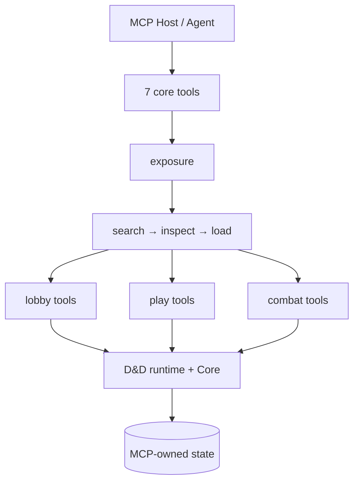

# SagaSmith D&D MCP

[官网](https://sagasmithai.github.io) · [平台总览](https://github.com/SagaSmithAI/.github/blob/main/profile/README.md) · [SagaSmith Web](https://github.com/SagaSmithAI/SagaSmith-service) · [内容目录](https://github.com/SagaSmithAI/SagaSmith-dnd-content-library)

> Current source: `sagasmith-dnd/packages/mcp`. It is released from the D&D vertical monorepo together with its Domain, Skills, and Workbench contracts.

## MCP 2026-07-28 / 协议兼容

The primary protocol is MCP `2026-07-28` on both stdio and Streamable HTTP. It uses
`server/discover`, a deterministic sorted `tools/list`, private cache hints
(`ttlMs=300000`), and request metadata. HTTP has no authoritative transport session.
Every hosted tool call verifies a short-lived `sagasmith.auth-context/delegation-v2`
envelope for `target_service`, operation, audience, room turn, campaign/revision,
resource owner, and acting character. Browser tokens and tokens for another audience
must never be forwarded to this service.

Legacy initialize/session clients remain supported during migration. Their exposure
state and `tools/list_changed` notifications are compatibility behavior only. On the
modern path, `exposure(open)` returns an explicit owner-bound, expiring
`exposure_handle`; it is catalog guidance, not a capability, and never changes
`tools/list`. The Host chooses a phase/task subset for the model while every call is
re-authorized by the domain server.

现代路径不依赖隐藏 transport session。跨调用状态使用服务端签发的显式 handle，或显式
campaign/revision 参数；每次调用都重新校验身份、角色、阶段和 revision。Host 可以缩小提供给
模型的稳定目录，但不能把模型选择或提示词当作授权边界。

### Upgrade and rollback / 升级与回滚

1. Upgrade the Host to send per-request protocol headers/metadata and delegated auth v2.
2. Verify `server/discover`, deterministic `tools/list`, and one read/write canary over
   both configured transports before moving hosted traffic.
3. Roll back Host traffic to the documented legacy adapter if a client cannot yet
   negotiate 2026-07-28; do not restore session identity as an authority boundary.
4. Roll back this package and its lockfile together. No database migration is required
   by the protocol change.

## Content Pack gateway

The HTTP gateway connects to the one authoritative streamable-HTTP MCP process and projects its
facades for the D&D UI. It never creates a second in-process MCP owner.
It exposes campaign-aware inventory and detail reads for `core_rules`, `addon`, `module`, and
`preset`, streams `.sagasmith-pack` uploads into managed storage, and supports explicit
activate/deactivate/export/remove operations. Safe inventory/detail reads remain available in
Play and Combat; every write is still rejected outside Lobby by MCP. Import stores a finalized
Pack but never activates it.

Uploads default to 64 MiB and can be capped with
`SAGASMITH_DND_GATEWAY_UPLOAD_LIMIT=<bytes>`. The browser first verifies the Catalog archive
checksum, then MCP independently validates the schema-v2 descriptor, blobs, dependencies, and
D&D semantics. Export downloads are served only after an MCP-authorized managed-artifact check.

Local D&D process layout:

```powershell
$env:SAGASMITH_DND_MCP_TRANSPORT = "streamable-http"
$env:SAGASMITH_DND_MCP_HTTP_PORT = "8767"
sagasmith-dnd-mcp

$env:SAGASMITH_DND_MCP_URL = "http://127.0.0.1:8767/mcp"
$env:SAGASMITH_DND_UI_DIST = "C:\path\to\sagasmith-dnd\apps\ui\dist"
sagasmith-dnd-gateway
```

The gateway listens on `127.0.0.1:8766` by default and serves the built Workbench when
`SAGASMITH_DND_UI_DIST` is set. Both the gateway and Agent remain real MCP clients. Modern
clients cache the deterministic catalog privately; the legacy gateway adapter may still observe
`tools/list_changed` until its compatibility path is retired.

[平台总览](https://github.com/SagaSmithAI/.github/blob/main/profile/README.md) · [D&D runtime](https://github.com/SagaSmithAI/Sagasmith-dnd) · [D&D Skills](https://github.com/SagaSmithAI/sagasmith-dnd/tree/main/skills)

**SagaSmithAI 的 D&D 5e Agent 能力服务。** 它通过标准 MCP transport 将 SagaSmith Core、D&D 规则运行时、D&D Skills 和模组生成 Skill 组合成一个可被不同 Agent Host 复用的服务端边界；本地系统使用唯一的 streamable-HTTP 权威进程。

与“把 70+ 个工具一次性塞给模型”不同，本服务在 MCP 侧维护会话级 exposure：先发现能力组，再按当前 `lobby` / `play` / `combat` 阶段加载少量工具，并在阶段、权限或 TTL 改变时收回。

## 为什么 exposure 在 MCP 侧

- **跨 Host 一致** — NanoBot、Codex 或任何兼容 MCP client 使用同一套目录、权限与阶段规则。
- **会话隔离** — exposure 绑定 MCP session、认证 principal 和 campaign；同一服务上的两个会话可以加载不同工具组。
- **阶段安全** — 权威阶段来自 campaign state。开战后 lobby/play 写工具不会继续残留，结束战斗后 combat 工具被收回。
- **最小暴露** — 首次 `tools/list` 只有 7 个核心发现、诊断与展示工具，而不是整个领域 schema；其中 `skill_query` 允许零预设 Host 做有界工作流读取。
- **预算锁定** — 当前完整公开目录为 77 个工具；Lobby/Play/Combat 暴露上限分别为
  55/46/46。预算测试以代码中的 profile 为唯一真源，文档不再维护另一套兼容目录。
- **服务端执行门禁** — 未暴露工具不能直接调用；权限不是提示词约定。
- **规则与自设内容分界** — 已注册的标准规则 mechanic 由版本锁定的引擎实现执行；标准卡缺少结果实现时会在付款前要求补引擎，不能降级成自设解释。未注册的模组或自设角色卡必须在导入、构建或写卡事务内依据精确来源写入直接 Agent ruling 或受校验的通用计划；正式使用只执行已经保存的边界，不再临时补内容方案。

## 运行结构



默认状态目录：

```text
<workspace>/.sagasmith-dnd-mcp/
  data/ttrpgbase.db       # campaign, rules, FTS, branches, knowledge
  data/chroma_db/         # optional dense retrieval
  artifacts/modules/      # editable generated modules before import
  artifacts/rulebooks/    # content-addressed staged user books
  artifacts/normalized-rulebooks/ # verified normalization/OCR caches
  artifacts/content-packages/  # unified addon/module/preset/core-rules archives
```

客户端不应直接写 SQLite、ChromaDB 或 artifact 目录。所有写入通过 MCP，确保迁移、revision、幂等、权限与 audit receipt 使用同一过程边界。

## 安装与启动

Python 3.11+：

```powershell
pip install sagasmith-dnd-mcp
sagasmith-dnd-mcp
```

这是 D&D-only Local Kit 的文字基线：SQLite、FTS、Markdown/text、权威 MCP
handlers 和 Skills 均可用，不会强制安装 Core documents/vector/OCR/embedding、
Pillow、OpenCV、ChromaDB 或 Torch。重型模块只在调用对应能力时加载；未安装时会
返回明确的 extra 安装指令，不会让服务启动失败或静默降级。

| Extra | 能力 |
|---|---|
| `documents` | PDF 文本提取与页面渲染 |
| `images` | 角色图提取与战斗 PNG 展示 |
| `ocr` | RapidOCR、OpenCV、ONNX Runtime 及 PDF 支持 |
| `embedding` | Sentence Transformers 嵌入 |
| `vector` | ChromaDB 向量存储 |
| `dense` | `embedding` + `vector` |
| `gateway` | Workbench HTTP gateway |
| `all` | 全部文档、图片、OCR、嵌入与向量能力 |

```powershell
pip install "sagasmith-dnd-mcp[documents]"
pip install "sagasmith-dnd-mcp[images]"
pip install "sagasmith-dnd-mcp[ocr]"
pip install "sagasmith-dnd-mcp[dense]"
```

跨系统 Local Kit manifest 由 `SagaSmith-agent` 统一维护；本仓只声明 D&D wheel
及其 extras，不硬编码 Agent、CoC 或 Narrative 的安装 revision。

本地 MCP 的 stdio 与 loopback Streamable HTTP 运行同一个 `create_server()`
及同一组权威 handlers；tool schema、错误、revision、idempotency 和 authority
语义不得按 transport 分叉。stdio 适合一个 Agent 独占一个进程，多个本机客户端
共享常驻服务时使用 Streamable HTTP。

原始 MCP 仅在 loopback 上允许无签名启动。将
`SAGASMITH_DND_MCP_HTTP_HOST` 设为非 loopback 地址时，必须同时配置至少
32 字节的 `SAGASMITH_AUTH_CONTEXT_SECRET`；Gateway bearer token 只保护
Gateway，不能替代 MCP auth context。

若要连接 D&D Workbench UI，同时安装并启动 HTTP/SSE adapter：

```powershell
pip install "sagasmith-dnd-mcp[gateway]"
sagasmith-dnd-gateway
```

Gateway 默认只监听 `127.0.0.1:8766`，身份由服务端配置或上游认证会话绑定，浏览器不能选择 authoritative principal。战斗移动写请求不会直写数据库，而是调用同一服务实现中的 MCP 工具，因此仍经过 actor 权限、campaign/branch revision、幂等、五尺格、阻挡与反应窗口校验。SSE 只发布 revision 变化通知，客户端随后重新读取 audience-filtered DTO。

启用向量嵌入：

```powershell
pip install "sagasmith-dnd-mcp[dense]"
$env:SAGASMITH_DND_MCP_DENSE_ENABLED = "1"
sagasmith-dnd-mcp
```

## Agent 配置

NanoBot 本地 HTTP 示例：

```json
{
  "tools": {
    "mcpServers": {
      "sagasmith_dnd": {
        "type": "streamableHttp",
        "url": "http://127.0.0.1:8767/mcp",
        "toolTimeout": 900,
        "protocolVersion": "2026-07-28",
        "requestScopedDelegation": true,
        "enabledTools": ["*"]
      }
    },
    "ssrfWhitelist": ["127.0.0.1/32"]
  }
}
```

`injectPrincipal` 与 `sessionScoped` 在多人渠道中都必须开启。Host 注入的 principal 是认证身份，模型不能自行声明；每个逻辑 Agent 会话必须拥有独立 MCP session 与可变原生工具表。grant 工具中的目标 principal 与调用者身份是两个字段。

Nanobot 应把 `skills/full/skills` 加入 `externalSkillsDirs`，不要把
`full/` 包装目录当成两个运行 Skill 的根目录。

不具备可信逐请求身份注入的单用户 stdio Host 应设置
`SAGASMITH_DND_MCP_BOUND_PRINCIPAL_ID=<stable-user-id>`。服务端会覆盖模型提供的
principal；`system:local` 只适用于明确受信任的本地进程。

## 渐进式调用流程

```text
1. read sagasmith://bootstrap or skill_query(action="read", identifier="dnd.full")
2. use skill_query outline/section/search for task-specific guidance
3. campaign_query(view="resume") when resuming
4. exposure(action="open", campaign_id?, principal_id injected or process-bound)
5. exposure(action="search", query="create a 2024 character")
6. exposure(action="set", add_tool_ids=[...])
7. refresh tools/list and call newly visible tools directly
8. 重新 tools/list，原生调用新出现的工具
9. exposure(action="set", remove_tool_ids=[...]) 或等待阶段/TTL 自动收回
```

Host 使用原生 `tools/list` + `tools/call`；每次 exposure 变化后刷新列表。

## 能力组

| 阶段 | 组 | 用途 |
|---|---|---|
| lobby | `bootstrap`, `campaign`, `characters` | 建团、成员/分支/Snapshot、车卡和初始资源 |
| lobby | `rules`, `modules`, `memory` | 规则书/规则包、模组、长期记忆与 actor knowledge |
| lobby | `storage_admin` | 本地 schema 管理；只允许显式 local admin |
| play | `scene`, `characters`, `resolution` | 场景推进、非战斗状态、检定与开战 |
| combat | `observe`, `turn`, `actions` | 可见战斗状态、回合、攻击/法术/反应/移动 |
| combat | `save`, `map` | 战斗中分支 Snapshot 与临时地图更新 |

每个工具只有一份 phase、角色、campaign 与本地权限声明；`server_capabilities` 返回机器可读目录。

## D&D 能力面

### 战役、分支与知识

服务提供 campaign/membership、角色控制、事件、Snapshot DAG、branch checkout、continuity context、修订式记忆以及 PC/NPC 独立的 actor knowledge。玩家只能读取当前分支、允许的场景 scope、自己控制角色的完整 sheet，以及角色真正知道的事实。

Snapshot 是可独立恢复的全量 checkpoint，`recap` 才是父子节点差量。底层 schema v8 将每个完整状态文档独立保存为受大小限制和双重校验保护的 `zlib-1` 记录；读取、校验、恢复和导出仍物化同一个完整 JSON，不依赖祖先回放。切换 branch 前当前工作区必须已经保存；否则服务拒绝 checkout，避免角色状态与 actor knowledge 落在不同时间点。

### 规则与扩展书

用户规则书的完整路径是：

```text
rulebook_draft(start): Core+D&D 机械首轮
→ Agent 读取精确 evidence 并反复 edit
→ Agent 检查当前 revision 并显式 finalize
→ 原子生成不可变 v2 Pack
→ content_pack 显式 activate（若战役需要）
```

公开创作入口只有三个：`rulebook_draft`、`module_draft`、`content_pack`。规则书使用
`rulebook_draft(start)` 完成机械首轮，再由 Agent 反复执行 `evidence` 与 `edit`，最后
调用 `finalize` 原子冻结候选并生成 Pack。检查结果只要有 warning，start 就必须由 DM
显式传入 `acknowledge_warnings=true`。检索时传入精确
`source_ids`，防止同名章节或不同版本扩展混入证据。PDF 文本层使用 PDFium；纯图片或
乱码页按页调用 RapidOCR。标准化结果和原始页面提取结果都按内容校验和缓存，幂等重试
不会重复解析或 OCR 同一本书。

导入文本本身不会自动变成可执行规则。只有通过 mechanic IR 和 provider 校验的部分参与结算。2014/2024 核心引擎也封装为不可变内置 core pack；campaign 和 Snapshot 锁定精确版本、checksum 与依赖，恢复时缺少任何包都会拒绝物化状态。

冷启动 seed 不再使用文件数截断：它必须覆盖 Skills 随附的 2,032 个 SRD
Markdown 文件和 42 个来源分区，并在 `rule_seed_status` 中报告 missing/stale
coverage。商业 PHB/DMG/MM 与扩展书只从用户白名单目录生成 private addon，原文
和生成包不会进入仓库。

内置 SRD 条目和私有 addon 都执行同一发布门禁：结构化授予、已注册内核机制、
纯描述及怪物/法术等内容专属的来源绑定 Agent 裁定在构建时即写入。标准行动经济、
资源支付、攻击、伤害及缺失来源事实仍由引擎严格处理；内容专属散文可以由 Agent
依据持久 clause 在当前 DM 窗口裁定，但不得首次触发时创建或改写 resolution。

规则 profile/pack 写入要求最新 `expected_revision` 和稳定 `idempotency_key`。`campaign_rules(action="explain")` 给出当前 branch lock、fingerprint、mechanic ids 与引用；rule receipt 保留结算时使用的不可变证据。

### 模组与战斗空间

模组书使用 `module_draft(start/get/evidence/edit/finalize)`：Core+D&D 完成机械首轮，
Agent 从精确来源证据中发现问题、反复修改，并在确认当前 revision 后定稿。单书的切分、
归属、合并、缺项与 OCR 决策随草稿和最终 Pack 保存，不进入 Core/D&D 的全局启发式。

战斗在开始时固定一种 `positioning_mode`。`grid` 模式必须有编译后的临时地图和每名
参与者的坐标；引擎据此处理距离、阻挡、移动与反应窗口。`agent` 模式没有地图或坐标，
Agent 根据当前叙事判断范围、命中条件、视线、阻挡和友军波及，并为每次动作提交结构化
`spatial_facts`；引擎仍负责行动经济、资源、掷骰、伤害和事务。两种模式不会互相猜测或
静默降级。

已定稿 Module Pack 可以在 combat-grid template 中保留两种互不等价的图片引用：

- `map_asset_key` 仍是 DM/来源侧的私有引用，不会因为进入战斗或调用渲染而公开；
- `party_public_map_asset` 是单独的发布契约，必须绑定 Pack asset 的 SHA-256、MIME、
  实际像素尺寸、替代文本、许可/署名、`contain` 格网对齐信息，以及认证 DM 的
  `approved` / `party_public` 审查记录。

```json
{
  "party_public_map_asset": {
    "asset_key": "gate-map",
    "checksum": "<sha256>",
    "media_type": "image/png",
    "width": 1600,
    "height": 1200,
    "alt_text": "已审核、不含隐藏标记的门楼地图。",
    "license": "private party display",
    "attribution": "User-supplied artwork.",
    "grid_alignment": {
      "mode": "contain",
      "x": 0,
      "y": 0,
      "width_cells": 12,
      "height_cells": 8
    },
    "review": {
      "status": "approved",
      "audience": "party_public",
      "reviewer": "<authenticated DM principal>",
      "reviewed_at": "2026-08-28T00:00:00Z",
      "note": "No hidden doors, traps, unexplored labels, or DM notes."
    }
  }
}
```

只有第二种引用会进入 `party_public` 投影。服务在草稿编辑时核对认证 reviewer、
文件 checksum、MIME 与尺寸，在读取 Pack 时再次核对不可变 blob；任何缺失、损坏、
未授权或格式不一致都会回退到确定性纹理。背景图始终按格网区域 letterbox，不裁切，
权威格线、可见地形/迷雾投影、坐标与 token 最后绘制。实时战斗路径不会调用 ComfyUI
或其他生成器，渲染也不会写 campaign revision；因此图片失败不会阻断文字游戏。

### 统一 Content Package

PC、NPC 与怪物统一使用 `sagasmith.actor-card.v3`，并只在最终 `preset` 或 `module`
Pack 的 `actors` 中跨安装迁移。任意运行中 Character 不再有单卡导出旁路；导入 Pack 后，
再按精确 artifact/card identity 创建新的 Character。图片留在卡和归档中，campaign id、
revision、权限、ActorKnowledge、progress、world state、random stream、branch 与 Snapshot
均不迁移。

Addon、Module、Preset 与 Core Rules 全部使用 `sagasmith.content-package` v2，共享
manifest、结构化内容、actors、来源索引与内容寻址 blobs，同时保留各自的权限和激活语义。
`content_pack` 只管理已定稿的不可变 Pack：`list/get/import/export/activate/deactivate/remove`。
它没有 build、test 或 install 动作，也不接受 loose JSON、release manifest、
`.sagasmith-module`、inline descriptor 或旧 envelope。

`rulebook_draft(finalize)` 与 `module_draft(finalize)` 已完成编译、验证和归档。最终 Pack
携带精确来源绑定、审查 disposition、修订来源与 Agent confirmation；`content_pack(import)`
会复算 descriptor/blob checksum、依赖和 D&D 语义，再用新的本地 source/actor identity
重放内容。导入本身不授予战役权限；Addon、Core Rules 与 Module 仍需 Owner/DM 显式激活。
依赖锁定精确 version 与 checksum，冲突或缺失依赖会在对应导入/激活操作局部失败。

规则书或模组中的特殊版式错误由 Agent 在未定稿 draft 中修正。重复标题、邻近归属、
重叠片段、依赖 statblock 或泛化标题都不能单独触发全局推断；只有经过证明的跨书确定性
不变量才进入 Core 或 D&D。完整审查方法由 D&D Skill 提供，MCP 不再为每类个案增加恢复工具。

### Skills、resources 与 prompts

- Skill 文档资源：`sagasmith://skill/{skill_id}`
- 静态目录：`sagasmith://skills/overview`
- Skills 读取：核心 `skill_query` 的 `read|outline|section|search`
- 动态引用/数据/模板：核心 `skill_query(kind="asset", action="list"|"outline"|"section"|"search"|"read")`
- Prompts：`dnd_dm`、`module_generator`

Skill 深度通过 `skill_query(read|outline|section|search)` 按需读取；工具可见性由当前 exposure 的原生列表决定。
24 个工具组覆盖、依赖 DAG、真实工具成员、文档 checksum 和字符预算。
成功读取计划 fragment 后会返回 read receipt；checksum 未变化时同一 session
无需重复装载。Skill plan 只管理 Agent 上下文，不替代 MCP 权限和事务校验。

部分 Host 只发现静态 resources，不发现 resource templates；这时通过核心
`skill_query` 读取计划和动态资源。

## 配置

| 环境变量 | 作用 |
|---|---|
| `SAGASMITH_DND_MCP_HOME` | 移动服务拥有的全部本地状态 |
| `SAGASMITH_DND_MCP_DENSE_ENABLED=1` | 启用 embedding-backed retrieval |
| `SAGASMITH_DATABASE_URL` | 使用外部 Core 数据库 |
| `CHROMA_DB_URL` / `CHROMA_DB_PATH` | 远程或自定义本地 Chroma |
| `SAGASMITH_DND_SKILLS_DIR` | 指向 D&D Skills checkout |
| `SAGASMITH_DND_MCP_BOUND_PRINCIPAL_ID` | 单用户进程绑定的可信 principal；覆盖模型输入 |
| `SAGASMITH_MODULEGEN_SKILLS_DIR` | 指向 module generator checkout |
| `SAGASMITH_DND_MCP_RULE_IMPORT_ROOTS` | `os.pathsep` 分隔的规则书导入白名单 |
| `SAGASMITH_DND_MCP_RULE_OCR=0/1` | 是否对纯图片或乱码规则书页启用选择性 OCR；默认启用 |
| `SAGASMITH_DND_MCP_RULE_OCR_SCALE` | OCR 页渲染倍率；默认 `2.0` |
| `SAGASMITH_DND_MCP_MODULE_IMPORT_ROOTS` | `os.pathsep` 分隔的模组 PDF/Markdown/text 导入白名单 |
| `SAGASMITH_DND_MCP_AUTO_SEED=0` | 禁用 bundled core reference 自动 seed |
| `SAGASMITH_DND_MCP_TRANSPORT` | `stdio` 或本地系统使用的 `streamable-http` |
| `SAGASMITH_DND_MCP_HTTP_HOST` / `PORT` / `PATH` | MCP HTTP 监听地址，默认 `127.0.0.1:8767/mcp` |
| `SAGASMITH_DND_MCP_URL` | Gateway 连接的权威 MCP URL |
| `SAGASMITH_DND_UI_DIST` | Gateway 静态服务的 D&D Workbench `dist` 目录 |
| `SAGASMITH_DND_GATEWAY_HOST` / `PORT` | UI adapter 监听地址，默认 `127.0.0.1:8766` |
| `SAGASMITH_DND_GATEWAY_TOKEN` | 非 loopback 访问所需 Bearer token |
| `SAGASMITH_DND_GATEWAY_ORIGINS` | 逗号分隔的精确 CORS origin allowlist |

### 数据库升级与回滚

服务启动时会执行 Core Alembic 迁移，并要求数据库符合当前 Snapshot schema v8。部署前必须在服务停止且 SQLite WAL 已收敛后备份 `data/ttrpgbase.db`；外部数据库则使用其原生一致性备份。

当前格式没有数据库 downgrade 或双协议运行模式。若启动失败或需要回滚，停止服务，并将数据库、Core、D&D 与 MCP 恢复为一套匹配版本。

服务永远不会直接导入模型任意选择的路径。规则书必须位于 allowlisted root；商业内容由用户自行确保使用权。
Content package 的 `source_path` 同样只允许位于 rule/module import roots；服务端导出
写入 MCP 自有的托管 artifact 目录。

## 验证

```powershell
pytest
ruff check .

# 使用全新 home 的真实 smoke 数据；不会迁移旧数据
$env:PYTHONPATH = "$PWD\src;$PWD\..\sagasmith-core\src;$PWD\..\sagasmith-dnd\src"
python scripts\smoke_seed.py --home C:\tmp\sagasmith-dnd-smoke-01

# 对已经脱离原始 PDF 的一组 addon 做一次全新实例总验收；整个导入、启用、
# catalog 暴露、停用和精确重导出过程仍只调用公开 MCP 工具
python scripts\regression_addons.py C:\private\core-addons C:\private\book-addons `
  --home C:\tmp\sagasmith-dnd-addon-cold-start `
  --run-id all-private-addons-v1 `
  --output C:\tmp\sagasmith-dnd-addon-audit.json
```

内容包回归只编译 `catalog_only`、`mechanical_scope=descriptive`、
`regression_only=true` 的私有探针，不把未经 Agent/DM 审核的候选宣称为可执行规则。
接收端必须产生新的 source id，验证统一 descriptor 与所有 blob checksum，并可安装
全局内容定义；它绝不能自动修改 campaign rule profile。回归随后通过单独的
Owner/DM 操作启用和停用 Addon，并核对重导出的完整 `.sagasmith-pack` checksum。

Smoke seed 创建两个 PC、一个 NPC、相互隔离的 actor knowledge、一个见证事件、受审计的钱包变更和基线 Snapshot。

## 状态与许可

项目处于 Alpha，但这是 SagaSmithAI 当前最完整的 Agent-to-rules 参考实现。原创代码使用 Apache-2.0；用户导入内容保留各自许可与来源。
