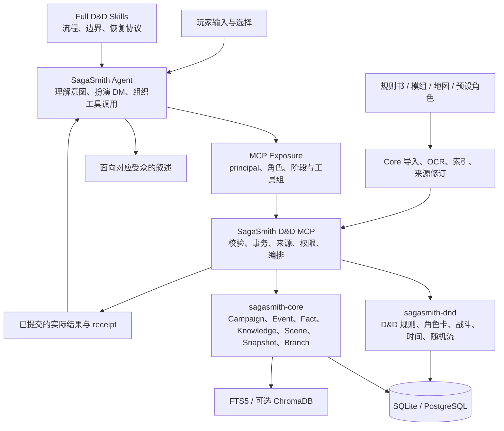

# SagaSmith D&D 长线叙事架构

本文说明当前完整运行链路中，所有参与长线叙事的组件、权威数据面、
读写时机、Agent 与引擎边界、恢复语义和已知限制。它描述的是当前实现，
不是未来设计提案。

适用链路：

```text
SagaSmith Agent
→ Full D&D Skills
→ SagaSmith D&D MCP
→ sagasmith-dnd
→ sagasmith-core
→ SQLite/PostgreSQL 与可选检索服务
```

`standalone/` 不具备本文所述的完整事务、ActorKnowledge、Snapshot DAG、
公开工具权限或恢复保证。

## 一句话模型

长线叙事不是一段不断增长的聊天摘要，而是以下四类数据协作：

1. 不可变的规则书和模组证据；
2. 当前分支上的角色、世界、时间和场景状态；
3. 按 actor 隔离的主观知识；
4. Agent 在有界上下文中根据证据与当前状态作出的当次提案；
5. 经 MCP 校验后，由引擎提交的实际结果。

Agent 不把“可能发生的剧情”写成已经发生的事实。引擎不猜 NPC 动机。
聊天记录、Dream、向量检索和 recap 都不是战役状态的最终权威。

## 总体数据流



一次典型裁定的数据方向是：

```text
精确原文 + 当前分支状态 + 当前 actor 视角
→ Agent 选择意图或作 DM 裁定
→ MCP 校验权限、阶段、来源、revision 和幂等键
→ D&D 引擎掷骰并执行规则
→ Core 原子提交事件、事实、知识和可选快照
→ Agent 只叙述已提交结果
```

## 参与组件及职责

| 层 | 当前职责 | 不负责 |
|---|---|---|
| SagaSmith Agent | 理解自然语言、询问玩家选择、扮演默认 DM、选择工具、执行零工具有界语义评估、解释结果、生成受众安全叙述 | 不作为战役数据库；不自行伪造工具成功；不保存权威 HP、知识或任务状态；不替人类 PC 作决定 |
| Agent Dream / workspace memory | 用户偏好、无障碍需求、桌面风格、Agent 身份和通用项目经验 | 不保存战役事件、角色秘密、HP、物品、任务或分支状态 |
| Full D&D Skills | 规定启动、导入、检索、角色准备、场景、战斗、连续性、分支和恢复流程 | 不执行 D&D 算术；不直接写数据库 |
| D&D MCP exposure | 按 session、principal、角色和 Lobby/Play/Combat 阶段暴露工具 | 不授予底层实现中不存在的权限 |
| SagaSmith D&D MCP | 公开事务边界、访问控制、严格参数、来源校验、revision、幂等、随机流提交、跨服务编排 | 不用自由文本替代引擎规则；不把模块搜索命中当成事实 |
| sagasmith-dnd | 2014/2024 D&D 角色卡、规则包、检定、攻击、法术、行动经济、资源、休息、时间和条件结算 | 不判断模组 NPC 的动机、谎言或剧情偏好 |
| sagasmith-core | Campaign、角色持久化、事件、事实、ActorKnowledge、模块、场景进度、Snapshot DAG、Branch、检索和原子连续性提交 | 不包含 D&D 专属规则；不决定主持风格 |
| 导入与 OCR | 将受管 PDF/Markdown 转为带校验和、页码和 chunk 的不可变来源；恢复图像型规则卡 | 不从规则记忆补全文本；不自动批准冲突来源 |
| Scene Index / Atlas | 保存来源支持的场景、地点及已审查拓扑，支持当前场景和临时战斗地图 | 不凭章节顺序推断连通；不自动证明墙体、掩护或精确站位 |
| 回归驱动器 | 通过公开 MCP 工具重复真实流程、保存报告、验证随机流和状态 | 不是生产状态权威；不得直写数据库或内置模组特例 |

## 权威数据面

同一个概念只能有一个写入权威。其他同名字段只能是投影、receipt、显示标签
或缓存。

| 信息 | 唯一权威 | 典型读取 | 典型写入 |
|---|---|---|---|
| 用户身份偏好、桌面风格 | Agent Dream | Agent workspace memory | Dream consolidation |
| 规则版本、版本锁和 locale | Campaign Rule Profile | `campaign_rules(action="get_profile")` | `campaign_rules` 的受控写入 |
| 规则和模组原文 | 不可变 RuleSource / ModuleSource revision 与 chunks | `rule_expand`、`module_expand`、`module_query(view="scene")` | 受控 import pipeline |
| 当前阶段 | `campaign.state.combat.active`；否则 `campaign.state.game_phase` | `campaign_query`、exposure | 合法的阶段切换和 `combat_start/end` |
| 当前场景 | 当前分支、scope 对应的 SceneProgress | `module_query(view="current/progress")` | `module_set_progress` |
| 场景地图拓扑审查 | SceneProgress 中的 `spatial_review` | 场景/进度查询 | `module_set_progress(spatial_review=...)` |
| 角色机械状态 | Character sheet v2 | `character_query(view="get")` | 角色、物品、资源、法术、状态和战斗工具 |
| 角色公开描述、关系和目标 | Character notes v2 | `character_query(view="get")` | 受控完整 notes 更新或创建流程 |
| 客观发生经过 | Campaign Event ledger | `campaign_event(action="list")`、`continuity_context` | `memory_change(action="commit").event` |
| 当前客观世界事实 | CampaignMemory revision ledger | `memory_query`、`continuity_context` | 稳定 `fact_key` 的 add/upsert/revise/supersede |
| 一个 actor 的知识或错误信念 | branch-local ActorKnowledge revision ledger | `actor_knowledge_query`、actor-scoped `continuity_context` | 每个 actor 单独 add/revise |
| 模组叙事证据索引 | DM-only `context_anchor` world fact | DM `continuity_context.module_evidence` | 首次实际使用前 `memory_change(action="upsert")` |
| 当前战役总览 | `campaign.state.playthrough_manifest`，其中机械字段由运行时同步 | `playthrough_manifest(action="get")` | initialize/replace/extend_modules/sync/verify_ending |
| 战役时间 | `campaign.state.game_time.elapsed_ticks` | campaign/manifest runtime projection | `clock_advance`、战斗轮、追逐、施法、休息等原子路径 |
| 日历显示 | branch-local `world_time` 投影 | campaign/manifest runtime projection | 一次 `clock_set` 锚定，随后由统一时钟推进 |
| 随机性 | branch-local server random stream state | receipt、manifest projection | 所有需要随机数的服务端事务 |
| 可恢复状态 | Snapshot 全量 payload 与 Branch head | `snapshot_query`、`branch_query` | continuity commit 内的 snapshot 或行政 checkpoint |
| 玩家 recap | Snapshot 的确定性 delta recap 与可选展示层 | `snapshot_query(view="recap")` | checkpoint 时生成或审查展示 |
| 事务审计 | revision group、idempotency receipt、rule/random receipts | `state_revision`、规则 receipt 查询 | 与实际状态变更在同一事务中写入 |
| 宿主上下文边界 | MCP 返回的 `host_context_binding` 与派生 `context_epoch` | campaign resume / continuity bundle | 宿主只保存绑定元数据；变化时重建模型上下文 |

### 不应成为第二权威的表示

- `derived` 是角色卡的计算投影，不能直接编辑。
- Combat 中的 combatant HP/条件是角色卡同步镜像，不是第二套角色状态。
- Playthrough manifest 中的 party HP、资源、快照和随机流由运行时同步，
  不能手工修成“看起来正确”。
- `world_time` 不是第二个推进时钟。
- `notes` 不保存角色知识；主观知识只进入 ActorKnowledge。
- recap、搜索命中、Agent 聊天上下文和回归报告都不是恢复权威。
- bounded evaluation proposal 不是事实、知识、角色行动或机械结果。
- Campaign 行政 `status` 不等于模组正式结局。

## 内容进入长线叙事的过程

### 规则书

规则书通过受控阶段进入 Core：

```text
stage
→ inspect
→ ingest
→ extract_candidates
→ Agent/DM review
→ compile
→ install
→ campaign-owner activation
```

每项可执行内容必须保留来源 revision、chunk、页码、校验和和 mechanic
引用。候选抽取不是批准。缺失或冲突证据必须停在 review 边界，不能靠模型记忆补齐。

Campaign Rule Profile 锁定 Core 版次和已确认扩展包。标准规则调用通过稳定
mechanic id 进入版本锁定的引擎实现。

### 模组、附件和地图

模组使用：

```text
module_draft(start → Agent evidence/edit loop → finalize) → content_pack(activate, kind="module")
```

导入结果包括：

- 物理资产和 SHA-256；
- 页码和解析质量；
- module/chapter/scene/chunk；
- restricted、group、public 场景可见性；
- Scene Index；
- 可证明的地点和连接；
- 内容候选、角色卡候选和 review block；
- 原始 PDF/Markdown 到结构化数据的 provenance。

`module_search` 只负责召回候选。Agent 必须 `module_expand` 或读取完整 scene
后才能把内容当作模组事实。

章节顺序、房间编号和文字相邻都不能自动建立地图连通。地图上的连接通过
受管页面渲染和 `spatial_review` 写入当前分支的 SceneProgress；不会反写
不可变模组。

### OCR 和无视觉 Agent

文本层缺失或混乱时，服务端先执行受管 OCR：

1. 校验导入 PDF 和页面资产；
2. 执行布局 OCR；
3. 对 AC、HP、六项属性、攻击、伤害等关键字段独立交叉验证；
4. 返回规范化 OCR 草稿和缺失的语义填充要求；
5. 无视觉 Agent 可以仅根据返回文本填写明确要求；
6. 只有证据仍然缺失或冲突时，才需要图像能力或人工 review。

OCR 草稿不是不可变 review。Agent 不得从相似怪物、规则常识或模型记忆补全
看不见的数字。

### 预设角色、NPC 和怪物

所有可参与游戏的 PC、NPC 和 monster 都是完整 Character 记录，使用同一个
sheet v2 与 notes v2 结构。

- 预设 PC 优先从对应玩家资料导入。
- 缺额 PC 必须经过合法车卡流程。
- 有精确 statblock 的 NPC/monster 使用完整机械卡。
- 只有身份和叙事、没有 statblock 的重要 NPC 使用 `narrative_npc`；
  它可以拥有关系、目标和 ActorKnowledge，但不能参加检定或战斗。
- 重复匿名生物每个实例拥有独立 actor id 和知识域。
- 死亡、离队和替补不会共用 actor id，原 actor 的知识也不会自动转移。

## Agent、规则卡和引擎的裁定边界

### 边界总表

| 内容类别 | 谁理解语义 | 谁掷骰/执行 | 如何长期保存 |
|---|---|---|---|
| 已锁定且已实现的标准 D&D mechanic | 引擎按 mechanic id | 引擎 | 角色/战斗状态、receipt、事件 |
| 标准规则但缺完整事务实现 | Agent 只能作明确 DM 裁定；不能伪装成完整引擎支持 | 可表达的通用部分由引擎；缺口保持可见 | 当次 ruling 与实际结果 |
| 扩展包的安全声明式 mechanic | review 后的规则包 | 已安装实现/声明式 IR | Rule Profile、receipt、角色状态 |
| 自设或模组机械卡 | 导入/审核保存精确来源与 direct ruling；DM Agent 可预编译或首次使用时编译 typed plan | allowlist 内的引擎函数或实时有界 DM 裁定 | portable source card 上的 source evidence、ruling requirement 与 persisted resolution |
| 一次性自设活动 | Agent 提交当前发生的 source-bound ruling | 引擎执行支付、保存、检定、伤害等通用事务 | occurrence-specific ruling 和 outcome |
| NPC 动机、退却、欺骗、谈判、剧情后果 | Agent | 引擎只执行移动、检定、时间、物品和状态原语 | 只保存实际发生的 event/fact/knowledge |
| 玩家角色的意图和需要玩家选择的资源 | 玩家 | 引擎 | 提交的选择和结果 |
| 规则包激活、权限提升 | campaign owner | MCP | Rule Profile / access ledger |
| 缺失或冲突来源 | 外部 source review，必要时有视觉 reviewer | 不执行 | review block 保持未解决 |

### 标准规则

标准规则优先硬实现。Agent 不能改变攻击加值、AC、豁免、伤害表达式、行动经济、
法术位、专注、死亡豁免、休息、升级或资源恢复公式。

一个标准卡返回
`semantic_solution.status="engine_implementation_required"` 时，必须在付款或
消耗资源前停止并补齐引擎，不能临时编译成自设方案。

“标准规则”不代表所有文字都应机械化。例如：

- False Appearance 依赖“保持不动”和识别事实，仍是描述性 Agent 边界；
- Legendary Resistance 涉及失败后选择、替换结果和次数支付，在完整原子选择
  窗口实现前保持 Agent 边界；
- NPC 的战术优先级仍由 Agent 选择，引擎只验证并执行合法动作。

### 自设和模组机械内容

导入、审核或导出自设内容时，系统必须完成 resolution audit。能够稳定表达的
内容保存严格、类型化的 `resolution_plan`；不适合自动化但来源完整的内容保存
精确 `source_ref`/`source_excerpt` 与 Agent-ruling requirement。两者都随
统一 content package 发布。如果某张自设卡尚无方案，DM Agent 可在 Lobby、Play 或 Combat
第一次实际触发时读取有界来源上下文，调用 `content_solution(action="compile")`
持久化一次；同一待处理窗口随后用 `combat_choice(action="execute_plan")` 继续，
之后始终复用指纹，不再次解释原文。

这不是一套新的通用叙事语言：

- 标准规则包的通用事务与已注册 mechanic 禁止被 Agent solution 覆盖；精确的
  法术、物品、怪物或特性专属文本可以在构建期保存来源绑定的 direct Agent clause，
  但该 clause 不能替代行动经济、支付、掷骰、伤害或时序；
- 已经可执行的卡禁止重复作者化；
- plan 不能包含任意代码；
- 当前发生条件仍需在每次使用时根据实时状态判断；
- 支付动作、次数、法术位和随机结果仍由引擎完成。

标准规则的执行契约仍只能由引擎提供，Agent 不能覆盖。自设卡则允许在第一次
实际使用时进入 `content_authoring_required`：DM Agent 读取精确卡片和来源证据，
在当前 Lobby/Play/Combat 阶段持久化一次通用方案，再从原待处理窗口继续。方案
绑定卡片、actor revision 与指纹；已发生的命中不会被重掷，也不能借此写入任意
状态补丁。

### 模组叙事

以下内容不编译成触发 DSL：

- NPC 受伤后倾向逃跑；
- 被俘后透露身份；
- 父母先欺骗、再谈条件；
- 某阵营基于关系采取行动；
- 某场景在玩家拒绝后出现新的谈判路径；
- 模组自设的氛围、目的、妥协和非机械后果。

系统只确保完整原文在相关 actor、场景、任务或物品参与时进入 DM Agent
上下文。Agent 结合实时状态作决定，再调用普通公开工具。

### 有界语义评估

当角色、受众、阵营、来源或裁定需要模型理解时，MCP 生成签名、只读、最小化的
bundle，宿主在全新零工具上下文中只返回固定 proposal：

```text
continuity_context(actor_turn | audience_render | faction_turn |
                   source_interpretation | bounded_ruling)
→ host isolated evaluation
→ bounded_evaluation(validate)
→ ordinary public engine tools
→ accepted event/fact/knowledge write
```

- `actor_turn` 只允许 NPC/monster 的意图与行动；人类 PC 的意图归玩家，任何台词改走 `npc_turn` 的结构化 speech acts。
- `audience_render` 强制 `audience="player"`，只使用服务端已过滤的受众投影，并原样发布验证后的文本。
- `faction_turn` 只读取该 faction 的 state/knowledge，不自动知道客观世界事实。
- `source_interpretation` 只解释精确来源，不激活或执行内容；问题必须原样绑定签名上下文，至少给出一条证据 claim，存在歧义或 uncertain claim 时必须转入 DM review。
- `bounded_ruling` 只决定 Agent-owned 语义，不接管玩家/owner/source-review 边界。

proposal 不能掷骰、付费、移动、攻击、改 HP/物品/时间/条件或写知识。它引用的
机械请求必须由公开引擎工具执行；任何写入都会使旧 bundle 失效。

## `context_anchor` 与 `continuity_context`

这两个名字容易被误解，必须分开：

- `context_anchor` 是持久化的、DM-only、branch-local CampaignMemory fact；
- `continuity_context` 是每次调用时动态拼装的只读响应，从不保存为一个 blob。

### 第一次写入

当前实现采用首次实际使用前的惰性写入：

1. 模组已经 ingest 和 activate；
2. Agent 搜索并展开覆盖完整附近叙事序列的 chunk；
3. 在 NPC、谈判或场景第一次进入 live play 之前；
4. Agent 调用 `memory_change(action="upsert")` 创建稳定 `context_anchor`；
5. 锚点引用 actor、scene/location、quest、faction、item 和精确 source binding；
6. 然后 Agent 调用 `continuity_context` 读取实际上下文。

模组导入本身目前不会自动生成所有 narrative anchor。

合法 anchor metadata 只有：

```json
{
  "schema_version": 1,
  "purpose": "检索标签，不是裁定内容",
  "related_refs": [
    "scene:<id>",
    "quest:<id>",
    "item:<id>"
  ],
  "source_bindings": [
    {
      "source_ref": {
        "module_id": "...",
        "scene_id": "...",
        "chunk_id": "...",
        "page_start": 1,
        "page_end": 1,
        "heading_path": ["..."],
        "content_sha256": "..."
      },
      "source_excerpt": "不可变 chunk 中实际存在的规范化原文"
    }
  ]
}
```

`subject_ref` 会被加入 related refs。以下字段会被服务端拒绝：

```text
predicate
trigger
condition
action
result
Agent instruction
translation
paraphrase
```

### 什么时候进入 Agent 上下文

DM 调用 `continuity_context` 时，服务端把调用方显式提供的 `related_refs` 与以下
实时引用合并：

- 当前战斗所有 combatant 和 reinforcement actor；
- playthrough manifest 当前 scene；
- 当前 module；
- 所有 active quest；
- 调用中明确指定的 actor 和 SceneProgress scope。

只要 active refs 与某个 anchor 的 related refs 有交集，锚点的精确
`source_excerpt` 就以
`context_role="non_executable_module_evidence"` 固定进入返回值。

固定证据：

- 在普通事实、事件和 ActorKnowledge 的词法预算之前保留；
- 相同 chunk/excerpt 去重；
- 每次重新验证 campaign 所有权、source ref、hash 和 excerpt；
- 超出安全上限时要求缩小 refs，而不是静默丢失；
- 对 player audience 永远返回空列表。

这仍然是 pull-based 工作流：只有调用了 `continuity_context` 才会组装上下文。
当前服务端不会在每个 NPC 回合开始时自动替 Agent 调用它。但对于提交内容引用了
匹配的 active `context_anchor` 来源的情况，`continuity_context` 返回当前
campaign revision、branch、principal 与实际 module evidence 绑定的签名
`context_receipt`；`memory_change(action="commit")` 强制验证该凭证。这样既不把
叙事原文变成自动触发器，又能阻止 Agent 跳过当前上下文直接提交这一类来源绑定裁定。

## Zaltember 端到端示例

假设 anchor 引用了：

```text
actor:zaltember
scene:ironslag-area18
location:ironslag-area31
quest:obtain-fire-giant-conch
item:fire-giant-conch
```

原文大意依次说明：

```text
受伤 → 逃往 31 区
被俘或逼入绝境 → 表明是 Zalto 之子
成为俘虏 → 可用于谈判
父母先尝试骗取释放
玩家拒绝 → 交海螺并约定安全释放
```

### 受伤后逃跑

1. Agent 在 Zaltember 回合前读取 combat status、角色卡、地图和
   `continuity_context`。
2. Engine 提供当前/最大 HP、conditions、位置和可用动作。
3. Agent 判断当前状态在原文语境中是否构成“受伤”，并选择逃往 31 区。
4. Agent 调用 `combat_movement`。
5. Engine 检查速度、路径、困难地形、剩余移动和借机攻击。
6. 一回合走不到就停在合法位置；不会因为原文说“逃往”而传送。
7. 只有实际位置、借机攻击结果和逃跑事件被保存。

### 被俘后透露身份

1. “被俘”可能由 Unconscious、Incapacitated、Restrained、Grappled、捆绑、
   位置、持有关系和已提交事件共同建立。
2. Agent 判断现在是否构成被俘或逼入绝境，以及 Zaltember 是否能够说话。
3. Agent 选择让他表明身份。
4. Campaign Event 记录说话行为。
5. 只有实际听到且能理解的人获得对应 ActorKnowledge。
6. 世界事实不会自动让所有角色知道该身份。

### 父母谈判和海螺

1. Agent 读取父母 actor、Zaltember 的 custody、当前场景、海螺库存和
   谈判原文。
2. Agent 先选择欺骗、承诺或讨价还价的内容。
3. 必要时 Engine 通过 `character_check(action="contest")` 同时掷
   Deception/Insight，或执行其他合法检定。
4. 玩家拒绝仍是玩家选择，不能由 Agent 替代。
5. 只有双方实际达成条件时，MCP 才通过 inventory/item transaction 转移海螺。
6. 承诺、转移、释放条件、各 actor 所知内容和任务结果分别写入其权威 ledger。
7. “可能交出海螺”不会提前出现在共享库存中。

在实际《风暴王之雷》回归中，Zaltember 被控制并捆绑，Agent 根据 Area 18
原文裁定人质停战；未选择的“受伤逃往 31 区”分支没有被写成已发生事件。

## 新 session 或恢复后的读取流程

Agent 每次 session 都应假定自己“刚醒来”，不能靠旧对话继续操作：

1. `storage_status`；
2. `campaign_query(view="resume", payload={"campaign_id": ...})`，一次取得 campaign、
   当前 branch/head、manifest、current scene、continuity、当前 context receipt
   与有效 phase；
3. 调用 `exposure(action="open")` 打开 campaign exposure；
4. 用 `exposure(action="search")` 找到所需工具，再用 `action="set"` 改变原生列表；
5. 处理 `tools/list_changed`，按原生 schema 直接调用工具；
6. 对每个实际行动 actor 单独调用 `continuity_context`；
7. DM 行为裁定加入相关 actor/scene/location/quest/item refs；
8. 重读 party 和所有相关 Character；
9. 丢弃跨 write、phase、branch、restore 留下的旧 revision、context receipt 和缓存卡。

Branch checkout 或 Snapshot restore 后必须完整重复该流程。旧上下文不能安全地
跨时间线使用。Skill fragment 只有 checksum 未变化时可以在同一 MCP session
复用；这不代表 campaign state 或 continuity context 可以复用。

`campaign_query(view="resume")` 和 continuity bundle 返回精确
`host_context_binding`。首次绑定或 campaign、principal、role、audience、branch、
restore 变化时，宿主必须停止同一模型回复中后续工具，丢弃旧消息、摘要、
workspace/Dream memory、缓存检索、receipt 与工具结果，并从当前用户请求和可信
MCP 结果重建。相同 `context_epoch` 不重复切换。

## 场景生命周期

### 场景准备

1. 展开完整 source scene；
2. 确认可见性、参与者、地图、地点和 source refs；
3. 准备所有需要机械行动的 actor；
4. 为第一次实际使用的叙事 NPC/谈判建立 context anchor；
5. 读取 preflight、局部禁用能力和所有 manual ruling requirement；
6. 解决 Agent-owned ruling；
7. 对玩家选择、owner approval 和缺失/冲突来源保持阻塞；
8. 更新 SceneProgress 的 current location 与 scene state。

### 场景进行

Agent 负责：

- 描述当前可见环境；
- 询问玩家意图；
- 选择 NPC 意图；
- 判断非机械环境事实和模组叙事语义；
- 选择应该调用的公开工具；
- 根据工具结果继续叙述。

Engine/MCP 负责：

- 检定、竞赛和随机结果；
- HP、资源、物品和条件；
- 法术位、准备法术、专注和行动经济；
- 移动、掩护、范围、反应和死亡；
- 时间与 timed effects；
- revision、幂等和原子提交；
- 来源与角色权限。

### 场景收尾

重要场景或战斗结束后，优先使用一次：

```text
memory_change(action="commit")
```

同一事务中提交：

- 一个已发生事件；
- 被接受的客观事实新增或修订；
- 每个实际知情 actor 各自的 ActorKnowledge 变更；
- 可选完整 Snapshot；
- source、Skill manifest 和审计 provenance。

任一 actor、fact revision 或来源不合法，整个连续性单元回滚。不能先写事件、
再补知识、最后把半成功状态称为已保存。

## 事件、事实与知识

### Campaign Event：发生了什么

Event 是不可变时间顺序记录。它可以是：

- 战斗结果；
- NPC 说了某句话；
- 玩家作出重要决定；
- 物品交付；
- 任务阶段完成；
- 角色死亡或离队；
- 一个 Agent DM ruling 的已提交结果。

Event 的 audience 不等于所有 actor 都知道它。

### CampaignMemory：现在客观上什么是真的

世界事实使用稳定 `fact_key`，例如：

```text
npc:zaltember:custody
item:fire-giant-conch:owner
location:ironslag-area31:door-state
faction:duke-zalto:relationship-to-party
```

同一事实变化时 revise 现有 head，不创建近似重复。旧 revision 保留审计历史。
同一个稳定 fact identity 可以在兄弟分支上拥有不同 head。
`fact_key` 一旦建立，其 `kind`、`subject`、`subject_ref`、`predicate` 不可改写；
需要表达另一个主体或谓词时必须使用另一个确定性 key。

`context_anchor` 也存放在该 ledger，但它的 kind、DM-only scope 和空 predicate
保证它只是来源索引，不表示该叙事分支已经发生。

### ActorKnowledge：谁知道、相信或误解什么

每个 PC、NPC 和 monster 都拥有独立的 branch-local knowledge ledger。它可以记录：

- 亲眼见到的事实；
- 听到的身份或传闻；
- 错误信息和谎言；
- 推理与怀疑；
- 忘记、修正或被告知的内容。

知识传播必须由剧情中的实际接触支持：

- 同场不必然等于看见或听懂；
- 世界事实不自动复制为 party knowledge；
- 死亡/离队 actor 的知识继续保留；
- replacement actor 不继承 predecessor 的知识；
- NPC 的 DM source context 不进入它的 ActorKnowledge，除非这是该角色在世界内
  合理知道的内容。

## 角色、关系和持久状态

Character sheet v2 保存机械状态：

- level、XP、class/subclass、species、background；
- abilities、skills、saves、movement；
- current/max/temp HP、Hit Dice、death saves、exhaustion；
- spellbook、known/prepared spells、slots、pact magic 和其他资源；
- inventory、wallet、equipment、attunement；
- conditions、effects、concentration；
- adventure_state 中的声望、贡献、祝福、结界和持续标签。

Character notes v2 保存 actor-authored 叙事身份：

- summary 和 appearance；
- backstory；
- relationships；
- goals。

动态世界关系如果影响整个战役，应写稳定 world fact；manifest 的 NPC
relationship 只能作为同步后的审计总览，不能成为第二权威。只有某 actor 的
态度或认知则写该 actor 的 notes/knowledge，不能混成全局真相。

## 时间和持续效果

所有叙事时间共享一个单调时钟：

```text
campaign.state.game_time.elapsed_ticks
1 tick = 6 seconds
```

以下操作都通过同一个时钟：

- 明确的 `clock_advance`；
- 战斗轮；
- chase 轮；
- 场外施法与仪式；
- Short/Long Rest；
- Stable recovery；
- 抄写法术等明确耗时活动。

`world_time` 只是日、时、分的 branch-local 日历投影。墙上现实时间、MCP exposure
TTL 和数据库 UTC timestamp 是 operational clock，绝不能推进游戏世界。

时钟事务同时推进：

- actor timed effects；
- world effects；
- calendar projection；
- character/resource changes；
- random stream；
- revision 和 receipt。

Agent 决定“旅程需要多久”属于 DM 语义；一旦决定，实际 ticks、effect 到期和
原子写入由引擎负责。

## 战斗如何参与长线叙事

战斗不是独立小游戏。它直接使用和更新同一批长期 actor：

- `combat_start` 从 SceneProgress、参与者清单和角色卡构造临时 combat map；
- combatant HP、resources、conditions 与 Character sheet 同步；
- 反应、专注、死亡、消耗品和法术位永久影响后续场景；
- 每轮推进统一时钟；
- reinforcement 通过 `combat_join` 在明确轮次进入；
- `combat_end` 回到 Play，并返回结构化 outcome；
- 场景收尾再用 continuity commit 保存事件、事实、知识和 checkpoint。

临时 combat map 可以包含 Agent 审查的当前几何事实，但不会反写成模组原文。
模组专属战术、援军语义或谈判退出条件由 Agent 判断，进入战斗的实际 actor、
轮次、位置和动作由引擎提交。

## Playthrough Manifest

Full-playthrough manifest 是跨章节、跨模组、跨战斗的可恢复控制与审计总览，
不是第二套角色或世界数据库。schema v1 包含：

- `run_id`、`campaign_line_id`、连续 `module_ids`；
- `status`：lobby/ready/in_progress/completed/blocked；
- 精确 source refs；
- 当前 module/chapter/scene/objective；
- reachable、visited、excluded scenes 与 branch decisions；
- 推荐队伍范围、选定人数、预设优先、成员与 replacement；
- tracked NPC、关系和状态；
- quests 与 clues；
- 叙事 world_state；
- Snapshot DAG 投影；
- random stream 投影；
- ending conditions、achieved condition 和 verification；
- review blocks。

每次读取/同步时，MCP 从权威运行时重新投影：

- party 名称、状态、level、XP、HP、resources、wallet、equipment；
- NPC 死亡/活动状态；
- 当前 SceneProgress；
- active branch 和 Snapshot head；
- random stream position；
- game phase、game/world time、world effects 和 combat active。

因此不能通过修改 manifest 绕过角色卡、scene progress、branch 或 random stream。

### 正式结局

Ending condition 必须带模组来源，并由一个或多个机器检查组成：

- manifest path；
- campaign state path；
- actor path；
- memory fact。

`verify_ending` 重新读取实时 manifest、campaign、actor 和 fact，并额外要求
combat 不活跃。只有所有检查通过时：

- `ending.status=completed`；
- `achieved_condition_id` 非空；
- verification 全部 passed；
- playthrough `status=completed`。

一段“胜利了”的 recap 或 campaign 行政状态不能代替正式结局。

## 随机流、revision 与幂等

### 随机流

需要骰子的结果只能由服务端随机流产生。事务记录：

- algorithm；
- seed fingerprint；
- before/after position；
- 本次 roll receipt；
- 与状态变更绑定的结果。

Snapshot 恢复和 branch fork 同时恢复对应随机流位置。回放必须用同一分支和
相同 occurrence/idempotency identity，不能客户端补骰。

### Revision

Campaign、Character、SceneProgress、Fact 和 ActorKnowledge 都使用 revision
或 revision head。写入携带当前 expected revision；冲突意味着必须重新读取并
重新裁定，不能覆盖。

### 幂等

每个实际 occurrence 使用稳定且唯一的 idempotency key。网络中断后重试同一
payload 会返回原结果或安全恢复 receipt，不会重复：

- 扣法术位；
- 造成伤害；
- 转移物品；
- 推进时间；
- 写事件；
- 创建快照。

换一个幂等键重复相同故事不是恢复，而是新的写入请求。

## Snapshot、Branch 和 Recap

### Snapshot

Snapshot 是可独立恢复的全量 checkpoint，包含：

- campaign state；
- Character 状态；
- SceneProgress；
- events/facts/knowledge bindings；
- active module revisions；
- rule/core fingerprints；
- random stream；
- Skill provenance；
- checksum 和 parent。

它不是聊天摘要。`recap` 才是相对父节点的玩家安全 delta。

推荐在以下边界创建 checkpoint：

- 开局准备完成；
- 有意义的场景结束；
- 关键战斗结束；
- level up 或重要休息完成；
- 重要分支选择前后；
- 正式结局。

不应为每次检定、每个回合或每个普通写入创建 Snapshot。

### Branch

Branch 的 head 指向 Snapshot DAG 节点。创建分支可以从父 snapshot 隔离探索
其他路径：

- 世界事实 head 独立；
- ActorKnowledge head 独立；
- SceneProgress 独立；
- 角色状态和随机流独立；
- sibling branch 不会被污染。

Checkout 前当前工作区必须有完整 Snapshot，避免丢失未保存状态。当前没有隐式
branch merge；需要比较时使用 `branch_query(view="compare")`。

### Restore

Restore 会从历史节点 fork 新历史，而不是把旧节点原地改写。恢复后必须：

1. 验证新 head 和 lineage；
2. 重开 exposure；
3. 重读 campaign、manifest、characters、scene progress；
4. 重读 events/facts；
5. 对每个 actor 重读 continuity context；
6. 丢弃恢复前所有上下文、revision 和工具结果。

## Recap 和 Agent workspace memory

Snapshot recap 只面向玩家总结“自上次保存后发生了什么”。它：

- 只能使用 player-safe event evidence；
- 不泄露未来剧情、隐藏房间、DC、statblock 或 DM-only source；
- 区分玩家选择与 DM/NPC 行动；
- 可以提出 `memory_candidates`；
- 不能直接写入 campaign ledger。

候选必须经过调用方审查并通过 domain continuity transaction 接受。Campaign
continuity 永远归 D&D MCP，不归 Dream。

Dream 只保存：

- 用户长期偏好；
- table tone；
- accessibility；
- Agent identity；
- 与具体战役状态无关的通用项目经验。

## 权限、受众与工具阶段

每个 MCP session/principal 拥有独立 exposure。阶段决定可加载工具：

- Lobby：导入、规则包、角色准备、行政和开局质量门禁；
- Play：场景、检定、时间、连续性、追逐和非战斗状态；
- Combat：回合、动作、反应、地图和战斗结算。

当前 compact public contract 为 89 个工具，其中冷启动 Core discovery
固定为 13 个；Lobby、Play、Combat 的暴露上限分别是 60、58、49。工具数量
预算不改变 action 级别的权限和事务边界。

角色和 campaign membership 决定：

- 谁能读取 keeper 内容；
- 谁能控制某个 actor；
- 谁能读取该 actor 的私密 card/knowledge；
- 谁能写 DM-only facts；
- 谁能激活规则包或操作分支。

Player 调用 `continuity_context` 永远看不到 DM `module_evidence`。知道一个 actor id、
scope id 或 branch id 不授予访问权限。

## Agent 应停下或继续的边界

默认由 Agent 完成 DM ruling，不应因为工具返回“DM review”就自动要求外部人类。

Agent 可以继续：

- 模组 NPC 的动机和战术；
- 描述性 activity；
- 环境事实；
- source-independent DM 时间估计；
- module-specific procedure；
- 可由现有公开原语执行的一次性结果。

必须等待或阻塞：

- 玩家拥有的角色选择；
- campaign owner 的规则包激活或权限批准；
- 缺失或相互冲突的来源；
- 无视觉 Agent 面对只剩图像且 OCR 无法确认的内容；
- 标准 mechanic 报告 `engine_implementation_required`；
- 当前公开工具无法原子执行所需状态改变。

## 当前明确限制

1. 模组 narrative anchor 不在 import 时自动全量生成；当前由 Agent 在首次实际
   使用前惰性创建。
2. `continuity_context` 是显式 pull；服务端会扩充 refs，但不会在每个 NPC 回合
   自动调用。对命中 active context-anchor 来源的 continuity commit，服务端会通过
   签名、revision-bound `context_receipt` 强制发生过正确的当前读取；其他纯描述性
   回合仍由 Agent 按工作流主动读取。
3. 模组叙事条件不会自动监听 HP、位置、custody 或对话并执行剧情。
4. Agent 必须把实时状态和 source evidence 一起读取后才可裁定。
5. 未实现完整原子事务的标准规则仍保持显式边界，不能靠近似实现隐藏缺口。
6. 自设 content solution 只覆盖允许的机械 recipe；direct ruling 只提供精确来源
   和实时裁定边界，两者都不表达完整叙事逻辑，也不得推迟到首次触发再创建。
7. Snapshot branch 当前不自动 merge。
8. 向量检索只帮助召回，不能替代 exact source 或 ledger authority。
9. Recap presentation 不能修复底层事实、知识或角色状态。
10. 回归驱动器能编排真实工具，但不是 live Agent 的第二套规则或叙事引擎。

## 长线叙事写入检查表

在写任何长期状态前确认：

1. 这是用户偏好、客观事件、客观事实、actor 知识、角色机械状态、场景进度，
   还是不可变来源？
2. 是否选中了唯一权威 owner？
3. 是否读取了当前 branch、phase 和 revision？
4. 是否展开了实际 source chunk，而不是只用搜索摘要？
5. 是否把 source premise 与实际发生地点分开保存？
6. 是否由玩家作出玩家拥有的选择？
7. Agent ruling 是否只决定语义，而没有重算引擎公式？
8. 引擎是否通过公开工具执行了真正的 HP、物品、资源、时间和随机结果？
9. 是否只给实际知情 actor 写 ActorKnowledge？
10. 是否避免保存未选择的假设分支？
11. 是否使用稳定 fact key 和新的 occurrence idempotency key？
12. 是否需要一次原子 post-scene continuity commit？
13. 这个边界是否值得 Snapshot，还是普通 revision 已足够？
14. 恢复或 checkout 后是否已经丢弃旧上下文并重读？
15. manifest 是否通过 runtime sync，而不是手工复制机械状态？
16. 正式结局是否通过 source-bound machine verification？

## 代码与流程索引

| 主题 | 当前实现或参考 |
|---|---|
| Agent 与 domain memory 所有权 | `SagaSmith-agent/nanobot/templates/AGENTS.md`、`nanobot/templates/agent/recap_generation.md` |
| 宿主有界上下文协议 | `full/references/host-integration-bounded-context.md` |
| Full Runtime 总入口 | `skills/full/SKILL.md` |
| 运行流程 | `full/references/workflows.md` |
| MCP 工具和单一权威表 | `full/references/mcp-contract.md` |
| Memory 路由 | `full/references/memory-ownership.md` |
| 角色卡权威 | `full/references/character-schema-v2.md` |
| 地图审查 | `full/references/module-visual-atlas.md` |
| 图像型 statblock/OCR | `full/references/module-image-content-review.md` |
| 回归验收 | `full/skills/dnd-dm/references/CAMPAIGN_REGRESSION.md` |
| context anchor schema | `sagasmith-core/src/sagasmith_core/context_anchors.py` |
| continuity context 组装 | `sagasmith-core/src/sagasmith_core/continuity.py` |
| Campaign/Event/Fact/Knowledge/Snapshot | `sagasmith-core/src/sagasmith_core/` 对应 services |
| D&D manifest schema | `sagasmith-dnd/src/sagasmith_dnd/playthrough.py` |
| 角色和规则结算 | `sagasmith-dnd/src/sagasmith_dnd/` |
| 公开事务与 exposure | `packages/mcp/src/sagasmith_dnd_mcp/server.py` |
| 真实跑团驱动器 | `packages/mcp/scripts/regression_playthrough.py`、`regression_encounter.py` |
